# Budget Book - アーキテクチャ図

## 全体構成図

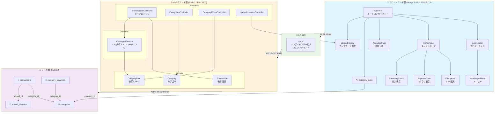

---

## データフロー：CSV インポート

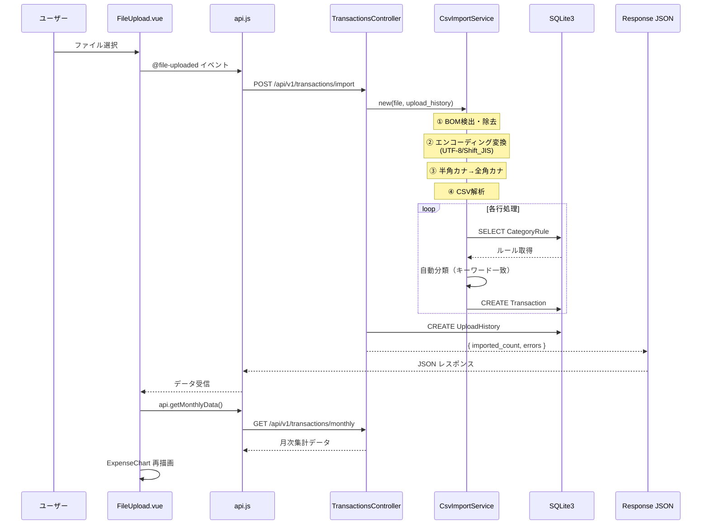

---

## カテゴリ自動分類ロジック

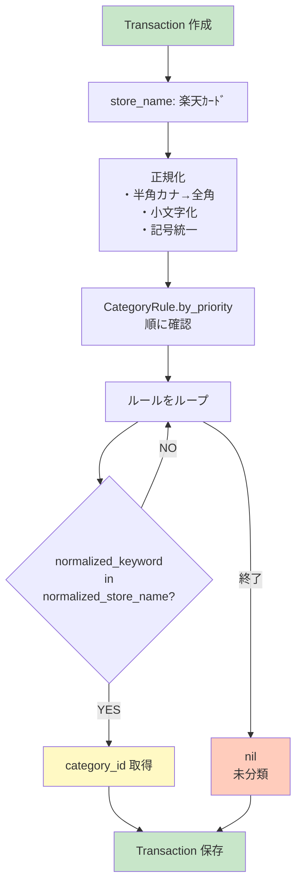

---

## ページ遷移図

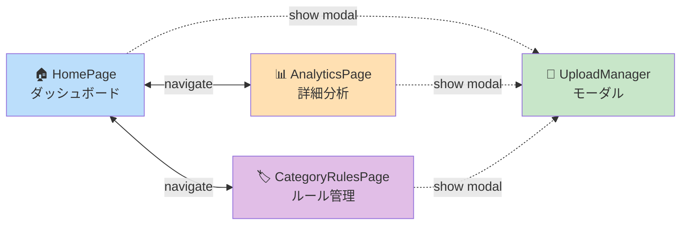

---

## API エンドポイント一覧

```mermaid
graph TB
    API["🔌 API エンドポイント<br/>/api/v1"]

    API --> TX["Transactions"]
    TX --> TXList["GET /transactions<br/>一覧・検索"]
    TX --> TXUpdate["PATCH /transactions/:id<br/>更新"]
    TX --> TXImport["POST /transactions/import<br/>CSV インポート"]
    TX --> TXMonth["GET /transactions/monthly<br/>月次集計"]
    TX --> TXAnalytics["GET /transactions/analytics<br/>詳細分析"]

    API --> CAT["Categories"]
    CAT --> CATList["GET /categories<br/>カテゴリ一覧"]

    API --> RULE["CategoryRules"]
    RULE --> RULEList["GET /category_rules<br/>ルール一覧"]
    RULE --> RULECreate["POST /category_rules<br/>作成"]
    RULE --> RULEUpdate["PATCH /category_rules/:id<br/>更新"]
    RULE --> RULEDelete["DELETE /category_rules/:id<br/>削除"]
    RULE --> RULEBulk["PATCH /category_rules/bulk_update<br/>一括更新"]

    API --> UP["UploadHistories"]
    UP --> UPList["GET /upload_histories<br/>履歴一覧"]
    UP --> UPGet["GET /upload_histories/:id<br/>詳細取得"]
    UP --> UPDelete["DELETE /upload_histories/:id<br/>削除"]

    style API fill:#fff9c4
    style TX fill:#bbdefb
    style CAT fill:#c8e6c9
    style RULE fill:#ffe0b2
    style UP fill:#f8bbd0
```

---

## コンポーネント階層図

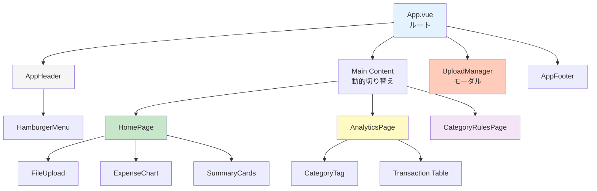

---

## データモデルと関連図

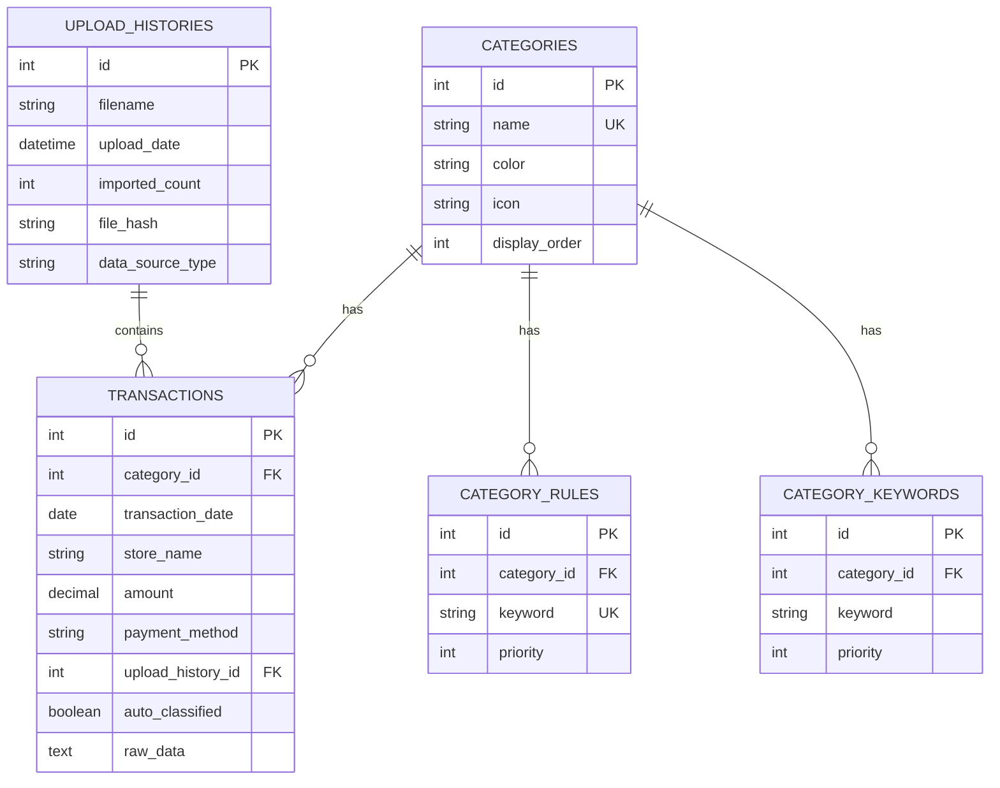

---

## 状態管理フロー（App.vue）

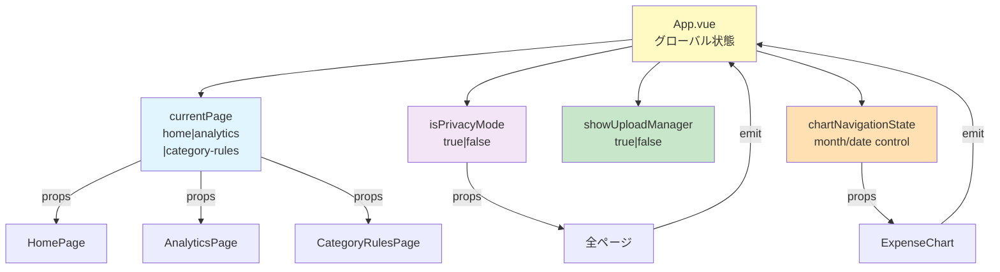

---

## テクノロジースタック

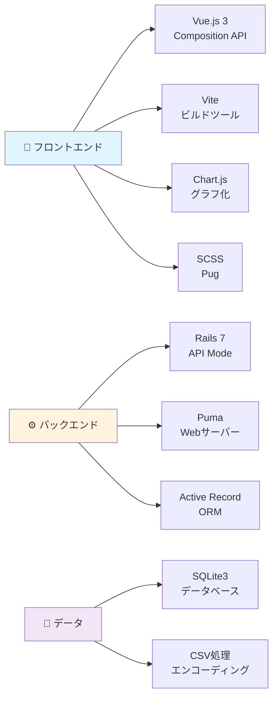

---

## CSV インポート処理の詳細

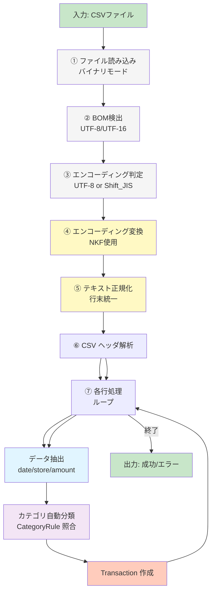

---

## リクエスト-レスポンスパターン

### ① ファイルアップロード

```mermaid
graph LR
    Client["クライアント<br/>FileUpload.vue"]
    Server["サーバー<br/>TransactionsController"]
    DB["データベース<br/>SQLite3"]

    Client -->|POST multipart/form-data<br/>form: { file: File }| Server
    Server -->|Transaction.create| DB
    Server -->|UploadHistory.create| DB
    DB -->|confirmation| Server
    Server -->|JSON Response| Client

    style Client fill:#e1f5ff
    style Server fill:#fff3e0
    style DB fill:#f3e5f5
```

### ② 月次データ取得

```mermaid
graph LR
    Client["クライアント<br/>HomePage.vue"]
    Server["サーバー<br/>TransactionsController"]
    DB["データベース<br/>SQLite3"]

    Client -->|GET /api/v1/transactions/monthly| Server
    Server -->|SQL: GROUP BY category<br/>SUM(amount)| DB
    DB -->|query result| Server
    Server -->|JSON: {<br/>category_totals,<br/>monthly_totals<br/>}| Client

    style Client fill:#e1f5ff
    style Server fill:#fff3e0
    style DB fill:#f3e5f5
```

---

## パフォーマンス・最適化

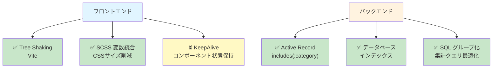

---

## 今後の拡張計画

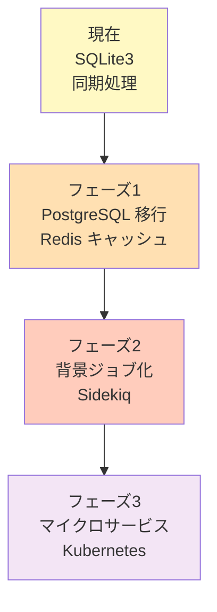

---

## セキュリティ機能

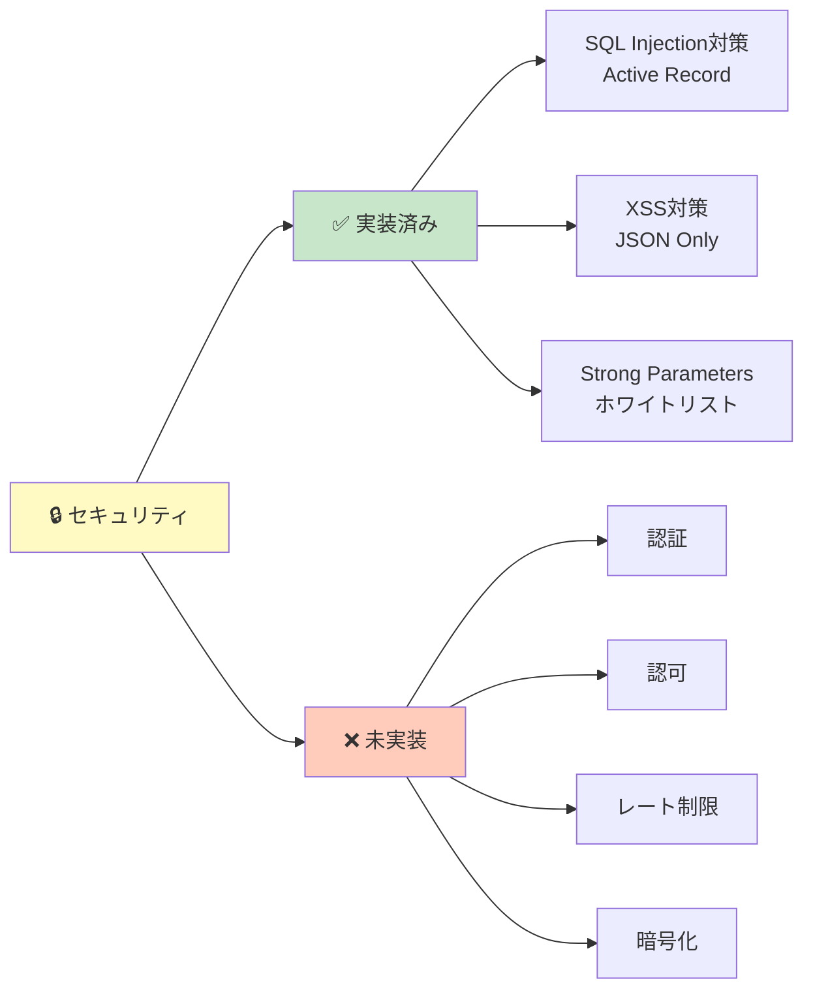
