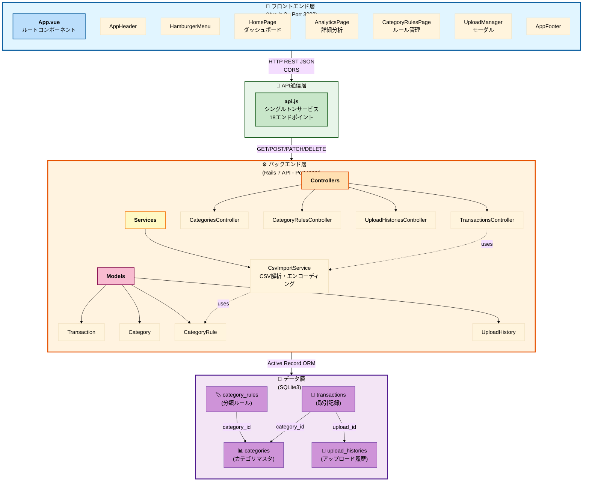
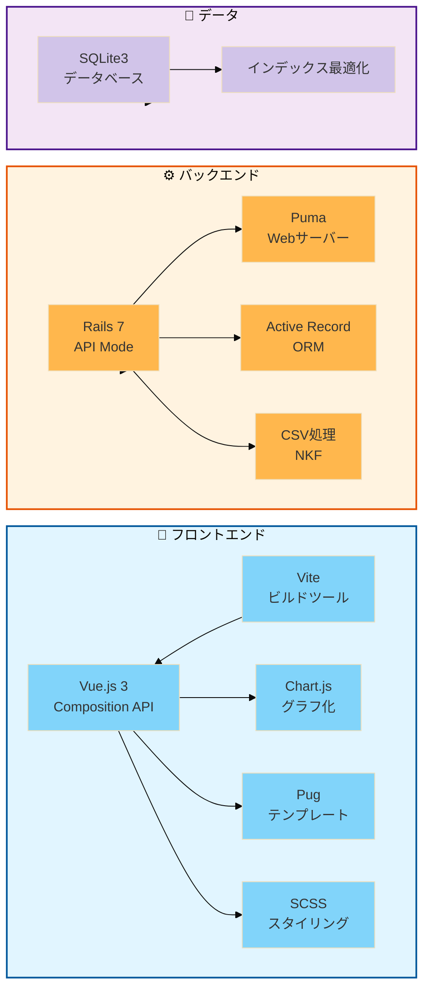
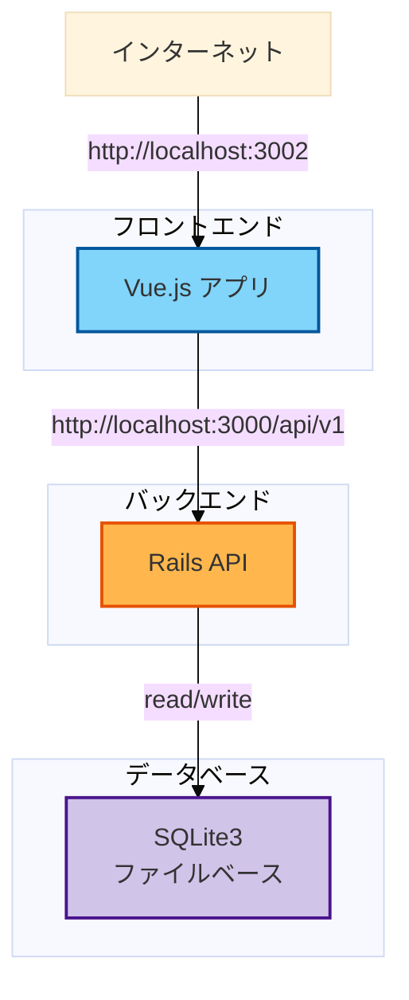

# Budget Book - アーキテクチャ全体図

## 全体構成図

```mermaid
%%{init: {'theme': 'base', 'themeVariables': { 'fontSize': '18px', 'fontFamily': 'arial', 'primaryTextColor': '#000'}, 'flowchart': {'htmlLabels': true}}}%%
graph TB
    subgraph Frontend["🎨 フロントエンド層<br/>(Vue.js 3 - Port 3002)"]
        direction TB
        App["<b>App.vue</b><br/>ルートコンポーネント"]
        Header["AppHeader"]
        Menu["HamburgerMenu"]
        HomePage["HomePage<br/>ダッシュボード"]
        AnalyticsPage["AnalyticsPage<br/>詳細分析"]
        RulesPage["CategoryRulesPage<br/>ルール管理"]
        UploadModal["UploadManager<br/>モーダル"]
        Footer["AppFooter"]
    end

    subgraph APILayer["🔌 API通信層"]
        direction TB
        ApiService["<b>api.js</b><br/>シングルトンサービス<br/>18エンドポイント"]
    end

    subgraph Backend["⚙️ バックエンド層<br/>(Rails 7 API - Port 3000)"]
        direction TB
        Controllers["<b>Controllers</b>"]
        TxController["TransactionsController"]
        CatController["CategoriesController"]
        RuleController["CategoryRulesController"]
        UploadController["UploadHistoriesController"]

        Services["<b>Services</b>"]
        CsvService["CsvImportService<br/>CSV解析・エンコーディング"]

        Models["<b>Models</b>"]
        Transaction["Transaction"]
        Category["Category"]
        Rule["CategoryRule"]
        Upload["UploadHistory"]

        Controllers --> TxController
        Controllers --> CatController
        Controllers --> RuleController
        Controllers --> UploadController

        Services --> CsvService
        Models --> Transaction
        Models --> Category
        Models --> Rule
        Models --> Upload

        TxController -.->|uses| CsvService
        CsvService -.->|uses| Rule
    end

    subgraph Database["💾 データ層<br/>(SQLite3)"]
        direction TB
        Categories["📊 categories<br/>(カテゴリマスタ)"]
        Transactions["📝 transactions<br/>(取引記録)"]
        Rules["🏷️ category_rules<br/>(分類ルール)"]
        Uploads["📂 upload_histories<br/>(アップロード履歴)"]

        Transactions -->|category_id| Categories
        Transactions -->|upload_id| Uploads
        Rules -->|category_id| Categories
    end

    Frontend -->|HTTP REST JSON<br/>CORS| APILayer
    APILayer -->|GET/POST/PATCH/DELETE| Backend
    Backend -->|Active Record ORM| Database

    style Frontend fill:#e1f5ff,stroke:#01579b,stroke-width:3px
    style Backend fill:#fff3e0,stroke:#e65100,stroke-width:3px
    style Database fill:#f3e5f5,stroke:#4a148c,stroke-width:3px
    style APILayer fill:#e8f5e9,stroke:#1b5e20,stroke-width:2px
    style App fill:#bbdefb,stroke:#01579b,stroke-width:2px
    style ApiService fill:#c8e6c9,stroke:#1b5e20,stroke-width:2px
    style Controllers fill:#ffe0b2,stroke:#e65100,stroke-width:2px
    style Services fill:#fff9c4,stroke:#f57f17,stroke-width:2px
    style Models fill:#f8bbd0,stroke:#880e4f,stroke-width:2px
    style Categories fill:#ce93d8,stroke:#4a148c,stroke-width:1px
    style Transactions fill:#ce93d8,stroke:#4a148c,stroke-width:1px
    style Rules fill:#ce93d8,stroke:#4a148c,stroke-width:1px
    style Uploads fill:#ce93d8,stroke:#4a148c,stroke-width:1px
```

## テクノロジースタック

```mermaid
%%{init: {'theme': 'base', 'themeVariables': { 'fontSize': '16px', 'fontFamily': 'arial'}, 'flowchart': {'htmlLabels': true}}}%%
graph LR
    subgraph Frontend["🎨 フロントエンド"]
        Vue["Vue.js 3<br/>Composition API"]
        Vite["Vite<br/>ビルドツール"]
        Chart["Chart.js<br/>グラフ化"]
        Template["Pug<br/>テンプレート"]
        Style["SCSS<br/>スタイリング"]
    end

    subgraph Backend["⚙️ バックエンド"]
        Rails["Rails 7<br/>API Mode"]
        Puma["Puma<br/>Webサーバー"]
        AR["Active Record<br/>ORM"]
        CSV["CSV処理<br/>NKF"]
    end

    subgraph Data["💾 データ"]
        SQLite["SQLite3<br/>データベース"]
        Indexes["インデックス最適化"]
    end

    Frontend --> Vite
    Vite --> Vue
    Vue --> Chart
    Vue --> Template
    Vue --> Style

    Backend --> Rails
    Rails --> Puma
    Rails --> AR
    Rails --> CSV

    Data --> SQLite
    SQLite --> Indexes

    style Frontend fill:#e1f5ff,stroke:#01579b,stroke-width:2px
    style Backend fill:#fff3e0,stroke:#e65100,stroke-width:2px
    style Data fill:#f3e5f5,stroke:#4a148c,stroke-width:2px
    style Vue fill:#81d4fa
    style Vite fill:#81d4fa
    style Chart fill:#81d4fa
    style Template fill:#81d4fa
    style Style fill:#81d4fa
    style Rails fill:#ffb74d
    style Puma fill:#ffb74d
    style AR fill:#ffb74d
    style CSV fill:#ffb74d
    style SQLite fill:#d1c4e9
    style Indexes fill:#d1c4e9
```

## ポート構成

```mermaid
%%{init: {'theme': 'base', 'themeVariables': { 'fontSize': '16px', 'fontFamily': 'arial'}, 'flowchart': {'htmlLabels': true}}}%%
graph TB
    Internet["インターネット"]

    subgraph Frontend["フロントエンド"]
        VueApp["Vue.js アプリ"]
    end

    subgraph Backend["バックエンド"]
        Rails["Rails API"]
    end

    subgraph Database["データベース"]
        SQLite["SQLite3<br/>ファイルベース"]
    end

    Internet -->|http://localhost:3002| VueApp
    VueApp -->|http://localhost:3000/api/v1| Rails
    Rails -->|read/write| SQLite

    style VueApp fill:#81d4fa,stroke:#01579b,stroke-width:2px
    style Rails fill:#ffb74d,stroke:#e65100,stroke-width:2px
    style SQLite fill:#d1c4e9,stroke:#4a148c,stroke-width:2px
```
