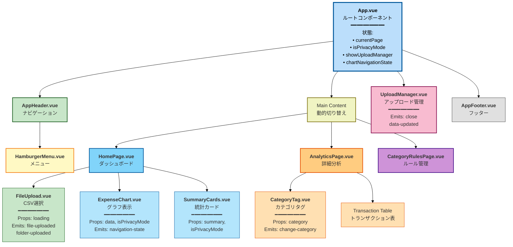
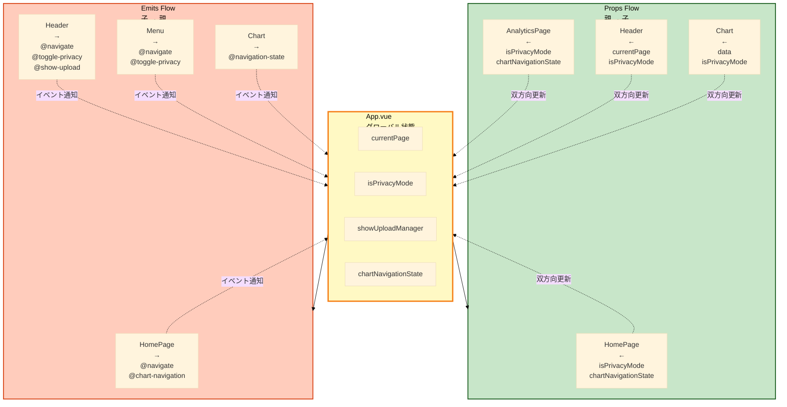
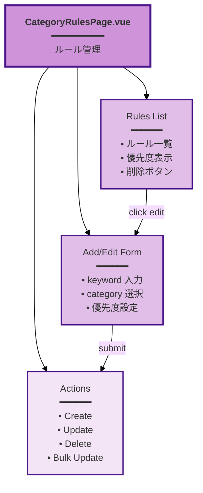
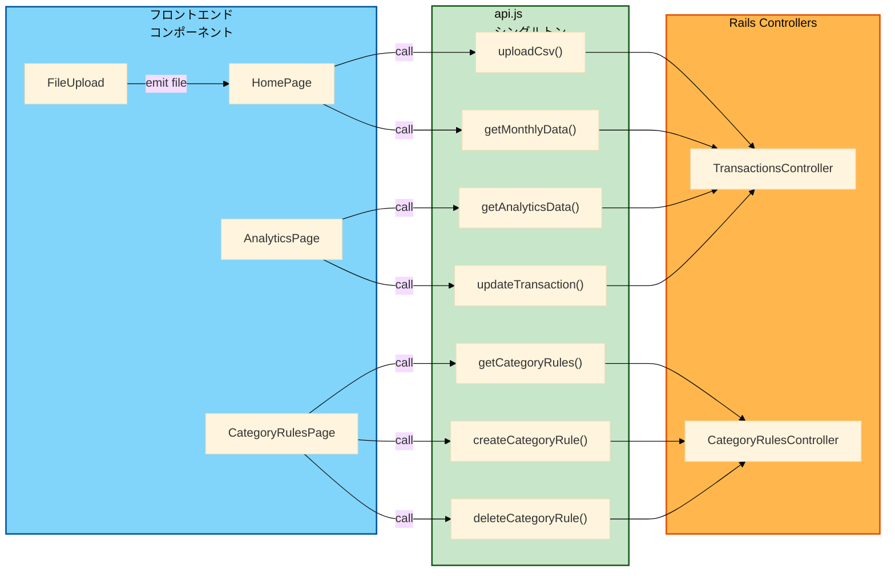

# Budget Book - コンポーネント構造図

## コンポーネント階層図



## Props と Emits の流れ



## ページコンポーネント詳細

### HomePage

```mermaid
%%{init: {'theme': 'base', 'themeVariables': { 'fontSize': '14px', 'fontFamily': 'arial'}, 'flowchart': {'htmlLabels': true}}}%%
graph TD
    Home["<b>HomePage.vue</b><br/>┏━━━━━━━━━━━━━━━━┓<br/>┃ Props:           ┃<br/>┃ • isPrivacyMode  ┃<br/>┃ • chartNavState  ┃<br/>┗━━━━━━━━━━━━━━━━┛<br/><br/>┏━━━━━━━━━━━━━━━━┓<br/>┃ State:           ┃<br/>┃ • loading        ┃<br/>┃ • chartData      ┃<br/>┃ • summaryData    ┃<br/>┗━━━━━━━━━━━━━━━━┛"]

    Upload["<b>FileUpload.vue</b><br/>━━━━━━━<br/>ファイル選択<br/>フォルダ選択<br/>プログレス表示"]

    Chart["<b>ExpenseChart.vue</b><br/>━━━━━━━<br/>月次グラフ<br/>カテゴリ円グラフ<br/>ナビゲーション"]

    Summary["<b>SummaryCards.vue</b><br/>━━━━━━━<br/>今月の支出<br/>月平均<br/>最大月支出<br/>データ件数"]

    Home --> Upload
    Home --> Chart
    Home --> Summary

    Upload -->|@file-uploaded| Home
    Upload -->|@folder-uploaded| Home
    Chart -->|@navigation-state| Home

    style Home fill:#81d4fa,stroke:#01579b,stroke-width:3px
    style Upload fill:#c8e6c9,stroke:#1b5e20,stroke-width:2px
    style Chart fill:#b3e5fc,stroke:#01579b,stroke-width:2px
    style Summary fill:#b3e5fc,stroke:#01579b,stroke-width:2px
```

### AnalyticsPage

```mermaid
%%{init: {'theme': 'base', 'themeVariables': { 'fontSize': '14px', 'fontFamily': 'arial'}, 'flowchart': {'htmlLabels': true}}}%%
graph TD
    Analytics["<b>AnalyticsPage.vue</b><br/>┏━━━━━━━━━━━━┓<br/>┃ Props:         ┃<br/>┃ • chartNavState┃<br/>┃ • isPrivacyMode┃<br/>┗━━━━━━━━━━━━┛<br/><br/>┏━━━━━━━━━━━━┓<br/>┃ Features:      ┃<br/>┃ • 日次トレンド ┃<br/>┃ • 店舗TOP10   ┃<br/>┃ • 統計表示     ┃<br/>┗━━━━━━━━━━━━┛"]

    DailyChart["Day Chart<br/>日次トレンド"]
    PieChart["Pie Chart<br/>カテゴリ分析"]
    BarChart["Bar Chart<br/>店舗TOP10"]
    Stats["Statistics<br/>統計情報"]
    TransTable["Transaction Table<br/>━━━━━━━━━━<br/>CategoryTag で<br/>カテゴリ変更可能"]

    Analytics --> DailyChart
    Analytics --> PieChart
    Analytics --> BarChart
    Analytics --> Stats
    Analytics --> TransTable

    TransTable --> CategoryTag["CategoryTag<br/>━━━━<br/>Props:<br/>• category<br/>Emits:<br/>• @change"]

    CategoryTag -->|@change-category| TransTable

    style Analytics fill:#ffcc80,stroke:#e65100,stroke-width:3px
    style DailyChart fill:#ffe0b2,stroke:#e65100,stroke-width:2px
    style PieChart fill:#ffe0b2,stroke:#e65100,stroke-width:2px
    style BarChart fill:#ffe0b2,stroke:#e65100,stroke-width:2px
    style Stats fill:#ffe0b2,stroke:#e65100,stroke-width:2px
    style TransTable fill:#ffb74d,stroke:#e65100,stroke-width:2px
    style CategoryTag fill:#ffe0b2,stroke:#e65100,stroke-width:1px
```

### CategoryRulesPage



## API通信パターン


