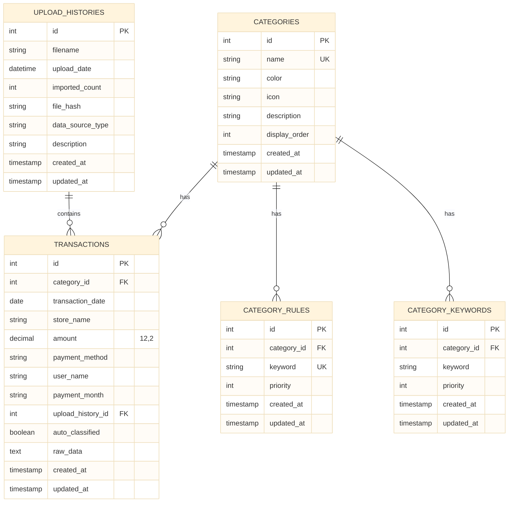
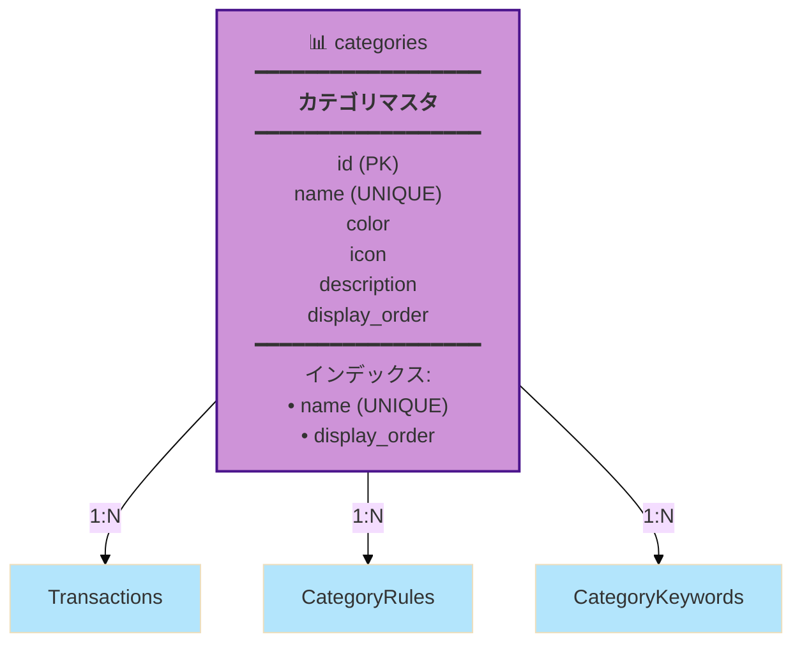
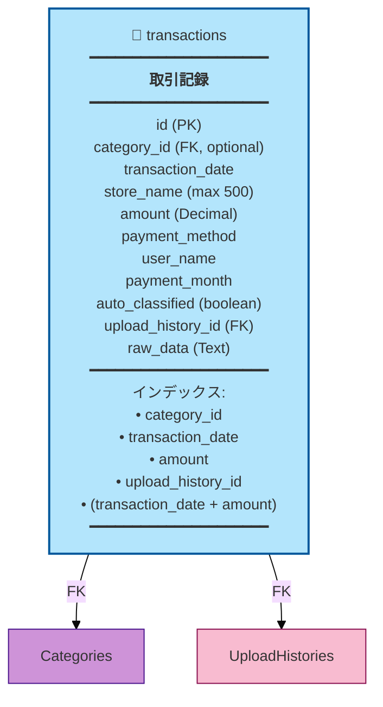
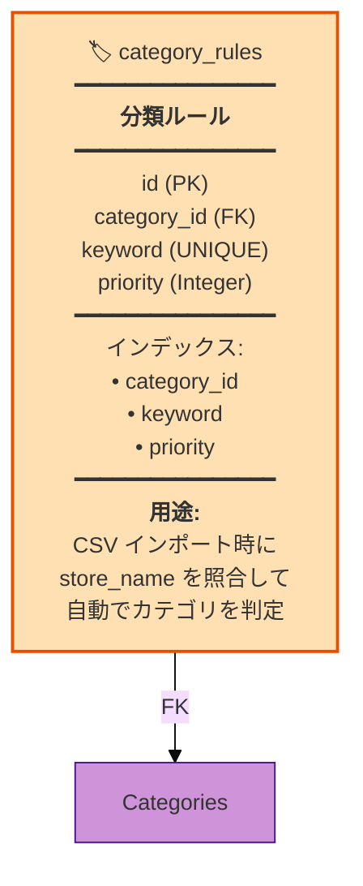
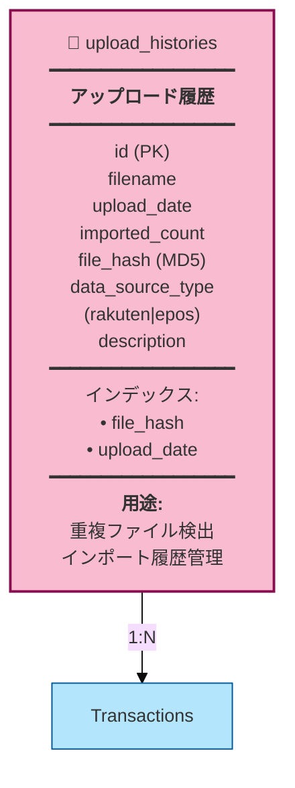
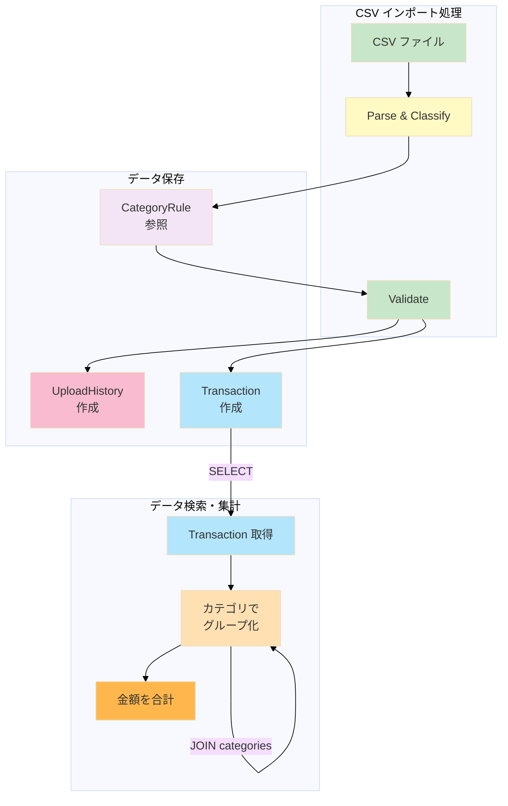
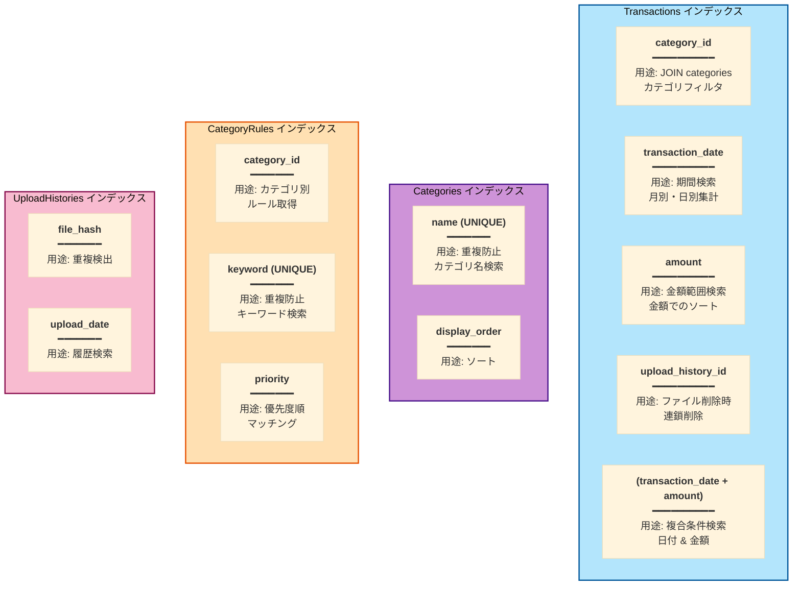
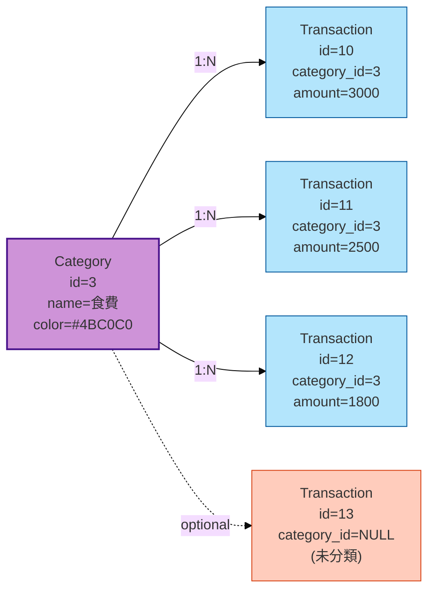
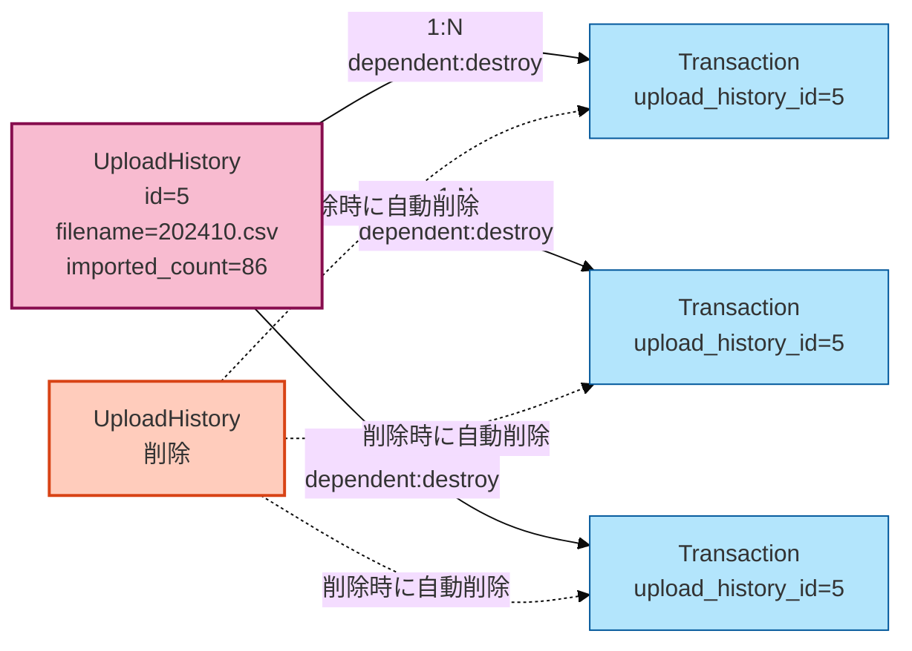
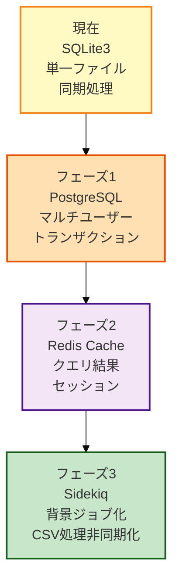

# Budget Book - データベース設計図

## データモデル関係図

## テーブル詳細図

### Categories テーブル

### Transactions テーブル

### CategoryRules テーブル

### UploadHistories テーブル

## データフロー：スキーマの観点

## インデックス戦略

## リレーション詳細

### Category → Transaction

### UploadHistory → Transaction (Cascade Delete)

## スケーリング戦略

