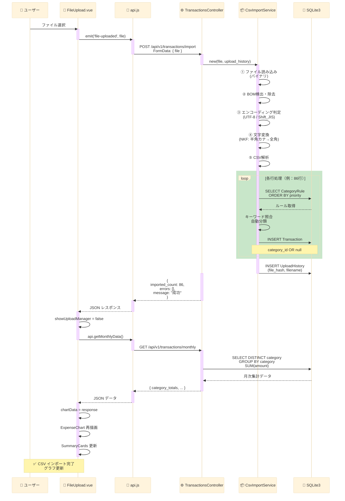
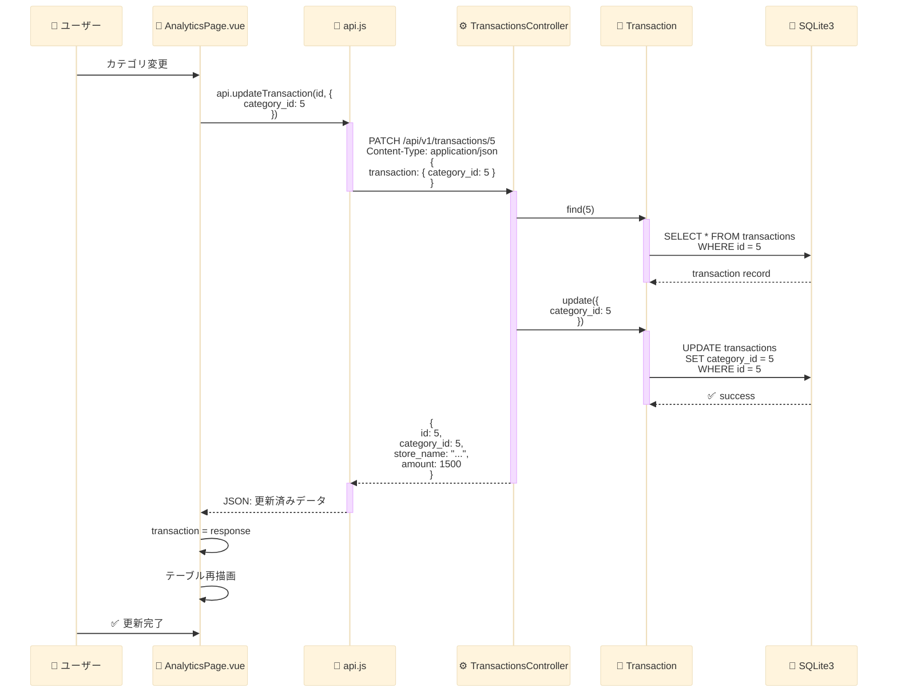
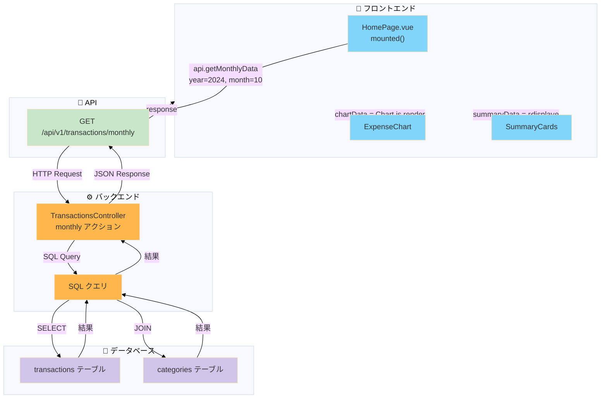
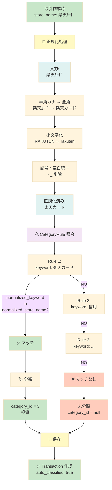
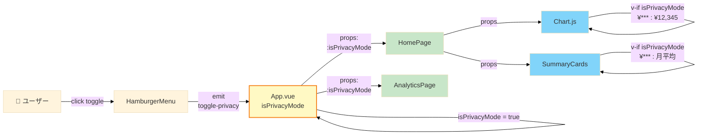

# Budget Book - データフロー図

## CSV インポートの流れ

```mermaid
%%{init: {'theme': 'base', 'themeVariables': { 'fontSize': '16px', 'fontFamily': 'arial'}, 'sequence': {'actorFontSize': '16px'}}}%%
sequenceDiagram
    participant User as 👤 ユーザー
    participant Frontend as 🎨 FileUpload.vue
    participant API as 🔌 api.js
    participant Controller as ⚙️ TransactionsController
    participant Service as 📦 CsvImportService
    participant DB as 💾 SQLite3

    User->>Frontend: ファイル選択
    activate Frontend
    Frontend->>API: emit('file-uploaded', file)
    deactivate Frontend

    activate API
    API->>Controller: POST /api/v1/transactions/import<br/>FormData: { file }
    deactivate API

    activate Controller
    Controller->>Service: new(file, upload_history)
    deactivate Controller

    activate Service
    Service->>Service: ① ファイル読み込み<br/>(バイナリ)
    Service->>Service: ② BOM検出・除去
    Service->>Service: ③ エンコーディング判定<br/>(UTF-8 / Shift_JIS)
    Service->>Service: ④ 文字変換<br/>(NKF: 半角カナ→全角)
    Service->>Service: ⑤ CSV解析

    rect rgb(200, 230, 201)
    loop 各行処理（例：86行）
        Service->>DB: SELECT CategoryRule<br/>ORDER BY priority
        DB-->>Service: ルール取得
        Service->>Service: キーワード照合<br/>自動分類
        Service->>DB: INSERT Transaction
        Note over Service,DB: category_id OR null
    end
    end

    Service->>DB: INSERT UploadHistory<br/>(file_hash, filename)
    deactivate Service

    activate Controller
    Controller-->>API: {<br/>  imported_count: 86,<br/>  errors: [],<br/>  message: "成功"<br/>}
    deactivate Controller

    activate API
    API-->>Frontend: JSON レスポンス
    deactivate API

    activate Frontend
    Frontend->>Frontend: showUploadManager = false
    Frontend->>API: api.getMonthlyData()
    deactivate Frontend

    activate API
    API->>Controller: GET /api/v1/transactions/monthly
    deactivate API

    activate Controller
    Controller->>DB: SELECT DISTINCT category<br/>GROUP BY category<br/>SUM(amount)
    DB-->>Controller: 月次集計データ
    Controller-->>API: { category_totals, ... }
    deactivate Controller

    activate API
    API-->>Frontend: JSON データ
    deactivate API

    activate Frontend
    Frontend->>Frontend: chartData = response
    Frontend->>Frontend: ExpenseChart 再描画
    Frontend->>Frontend: SummaryCards 更新
    deactivate Frontend

    Note over User,Frontend: ✅ CSV インポート完了<br/>グラフ更新
```

## トランザクション更新フロー

```mermaid
%%{init: {'theme': 'base', 'themeVariables': { 'fontSize': '16px', 'fontFamily': 'arial'}, 'sequence': {'actorFontSize': '16px'}}}%%
sequenceDiagram
    participant User as 👤 ユーザー
    participant Frontend as 🎨 AnalyticsPage.vue
    participant API as 🔌 api.js
    participant Controller as ⚙️ TransactionsController
    participant Model as 📝 Transaction
    participant DB as 💾 SQLite3

    User->>Frontend: カテゴリ変更
    Frontend->>API: api.updateTransaction(id, {<br/>  category_id: 5<br/>})

    activate API
    API->>Controller: PATCH /api/v1/transactions/5<br/>Content-Type: application/json<br/>{<br/>  transaction: { category_id: 5 }<br/>}
    deactivate API

    activate Controller
    Controller->>Model: find(5)
    activate Model
    Model->>DB: SELECT * FROM transactions<br/>WHERE id = 5
    DB-->>Model: transaction record
    deactivate Model

    Controller->>Model: update({<br/>  category_id: 5<br/>})
    activate Model
    Model->>DB: UPDATE transactions<br/>SET category_id = 5<br/>WHERE id = 5
    DB-->>Model: ✅ success
    deactivate Model

    Controller-->>API: {<br/>  id: 5,<br/>  category_id: 5,<br/>  store_name: "...",<br/>  amount: 1500<br/>}
    deactivate Controller

    activate API
    API-->>Frontend: JSON: 更新済みデータ
    deactivate API

    Frontend->>Frontend: transaction = response
    Frontend->>Frontend: テーブル再描画
    User->>Frontend: ✅ 更新完了
```

## ホームページデータ取得フロー

```mermaid
%%{init: {'theme': 'base', 'themeVariables': { 'fontSize': '16px', 'fontFamily': 'arial'}, 'flowchart': {'htmlLabels': true}}}%%
graph TB
    subgraph Frontend["🎨 フロントエンド"]
        HP["HomePage.vue<br/>mounted()"]
        Chart["ExpenseChart"]
        Summary["SummaryCards"]
    end

    subgraph API["🔌 API"]
        GetMonth["GET /api/v1/transactions/monthly"]
    end

    subgraph Backend["⚙️ バックエンド"]
        Ctrl["TransactionsController<br/>monthly アクション"]
        Query["SQL クエリ"]
    end

    subgraph DB["💾 データベース"]
        TX["transactions テーブル"]
        CAT["categories テーブル"]
    end

    HP -->|api.getMonthlyData<br/>year=2024, month=10| GetMonth
    GetMonth -->|HTTP Request| Ctrl

    Ctrl -->|SQL Query| Query

    Query -->|SELECT| TX
    Query -->|JOIN| CAT
    TX -->|結果| Query
    CAT -->|結果| Query

    Query -->|結果| Ctrl
    Ctrl -->|JSON Response| GetMonth

    GetMonth -->|response| Frontend

    Frontend -->|chartData = response| Chart
    Frontend -->|summaryData = response| Summary

    Chart -->|Chart.js render| Frontend
    Summary -->|display| Frontend

    style HP fill:#81d4fa
    style Chart fill:#81d4fa
    style Summary fill:#81d4fa
    style GetMonth fill:#c8e6c9
    style Ctrl fill:#ffb74d
    style Query fill:#ffb74d
    style TX fill:#d1c4e9
    style CAT fill:#d1c4e9
```

## カテゴリ自動分類フロー

```mermaid
%%{init: {'theme': 'base', 'themeVariables': { 'fontSize': '16px', 'fontFamily': 'arial'}, 'flowchart': {'htmlLabels': true}}}%%
graph TD
    Start["取引作成時<br/>store_name: 楽天ｶｰﾄﾞ"]

    Normalize["🔄 正規化処理"]
    Input["<b>入力:</b><br/>楽天ｶｰﾄﾞ"]
    Step1["半角カナ → 全角<br/>楽天ｶｰﾄﾞ → 楽天カード"]
    Step2["小文字化<br/>RAKUTEN → rakuten"]
    Step3["記号・空白統一<br/>- _ 削除"]
    Normalized["<b>正規化済み:</b><br/>楽天カード"]

    Query["🔍 CategoryRule 照合"]
    Rule1["Rule 1:<br/>keyword: 楽天カード"]
    Rule2["Rule 2:<br/>keyword: 信用"]
    Rule3["Rule 3:<br/>keyword: ..."]

    Match["✅ マッチ"]
    Assign["🏷️ 分類"]
    Category["category_id = 3<br/>投資"]

    NoMatch["❌ マッチなし"]
    Uncat["未分類<br/>category_id = null"]

    Save["💾 保存"]
    Created["✅ Transaction 作成<br/>auto_classified: true"]

    Start --> Normalize
    Normalize --> Input
    Input --> Step1
    Step1 --> Step2
    Step2 --> Step3
    Step3 --> Normalized

    Normalized --> Query
    Query --> Rule1
    Rule1 -->|normalized_keyword<br/>in<br/>normalized_store_name?| Match
    Match --> Assign
    Assign --> Category

    Rule1 -->|NO| Rule2
    Rule2 -->|NO| Rule3
    Rule3 -->|NO| NoMatch
    NoMatch --> Uncat

    Category --> Save
    Uncat --> Save
    Save --> Created

    style Start fill:#c8e6c9
    style Normalize fill:#fff9c4
    style Input fill:#e0f2f1
    style Normalized fill:#e0f2f1
    style Query fill:#f3e5f5
    style Match fill:#c8e6c9
    style NoMatch fill:#ffccbc
    style Category fill:#c8e6c9
    style Uncat fill:#ffccbc
    style Save fill:#fff9c4
    style Created fill:#c8e6c9
```

## プライバシーモード フロー

```mermaid
%%{init: {'theme': 'base', 'themeVariables': { 'fontSize': '16px', 'fontFamily': 'arial'}, 'flowchart': {'htmlLabels': true}}}%%
graph LR
    User["👤 ユーザー"]
    Menu["HamburgerMenu"]
    App["App.vue<br/>isPrivacyMode"]
    HomePage["HomePage"]
    Analytics["AnalyticsPage"]
    Chart["Chart.js"]
    Cards["SummaryCards"]

    User -->|click toggle| Menu
    Menu -->|emit<br/>toggle-privacy| App

    App -->|isPrivacyMode = true| App

    App -->|props:<br/>:isPrivacyMode| HomePage
    App -->|props:<br/>:isPrivacyMode| Analytics

    HomePage -->|props| Chart
    HomePage -->|props| Cards

    Chart -->|v-if isPrivacyMode<br/>¥*** : ¥12,345| Chart
    Cards -->|v-if isPrivacyMode<br/>¥*** : 月平均| Cards

    style App fill:#fff9c4,stroke:#f57f17,stroke-width:2px
    style HomePage fill:#c8e6c9
    style Analytics fill:#c8e6c9
    style Chart fill:#81d4fa
    style Cards fill:#81d4fa
```
