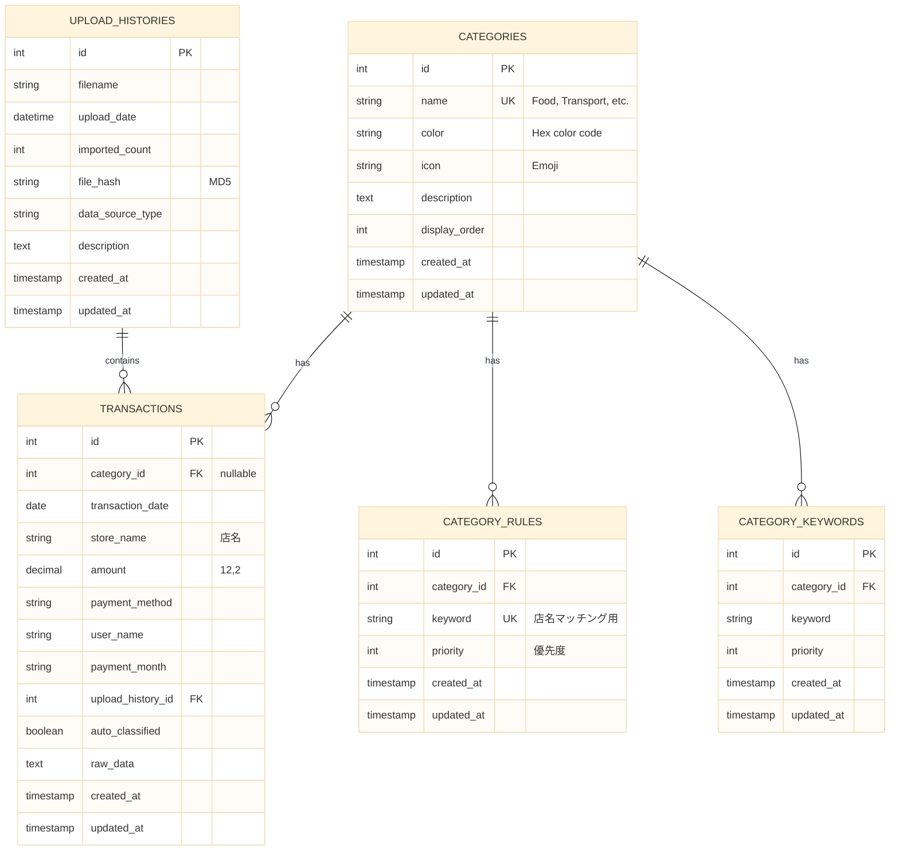
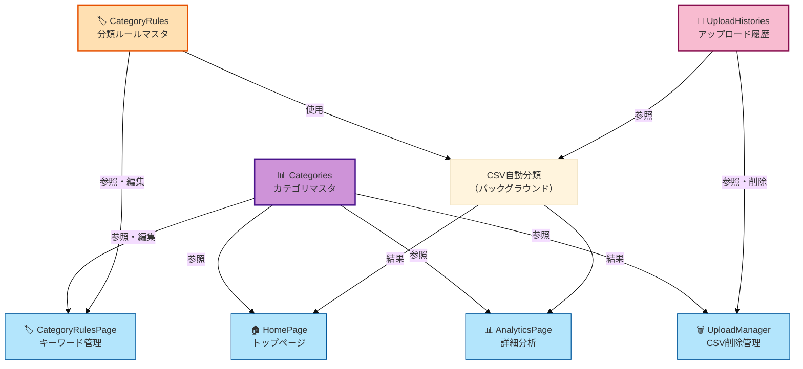

# マスタデータアーキテクチャ仕様書

**バージョン**: 1.0  
**作成日**: 2025 年 10 月 31 日  
**更新日**: 2025 年 11 月 5 日

---

## 📋 目次

1. [マスタデータとは](#1-マスタデータとは)
2. [マスタの種類と役割](#2-マスタの種類と役割)
3. [全体 ER 図](#3-全体er図)
4. [4 ページ間でのマスタ連携](#4-4ページ間でのマスタ連携)
5. [マスタ管理方針](#5-マスタ管理方針)

---

## 1. マスタデータとは

### 1.1 定義

マスタデータとは、Budget Book アプリケーション全体で共通利用される**基準となるデータ**です。取引データ（トランザクション）を分類・表示・分析するための基盤として機能します。

### 1.2 マスタデータの特徴

| 特徴             | 説明                                                         |
| ---------------- | ------------------------------------------------------------ |
| **共通利用**     | 複数のページ・機能で参照される                               |
| **比較的固定**   | 頻繁に変更されない（ただし、ユーザーが編集可能なものもある） |
| **基準となる**   | 取引データの分類や表示の基準となる                           |
| **リレーション** | 取引データとリレーションを持つ                               |

### 1.3 マスタデータの重要性

- **自動分類の精度**: 分類ルールマスタの品質が自動分類の精度に直結
- **UI 表示の一貫性**: カテゴリマスタが UI 全体の表示を制御
- **データ整合性**: マスタデータの整合性が取引データの整合性を保証

---

## 2. マスタの種類と役割

### 2.1 マスタ一覧

| マスタ名                   | テーブル名          | 目的                            | 管理方法                       | 利用範囲           |
| -------------------------- | ------------------- | ------------------------------- | ------------------------------ | ------------------ |
| **カテゴリマスタ**         | `categories`        | 支出分類の基準（8 カテゴリ）    | 初期値固定、ユーザー編集不可   | 全 4 ページ        |
| **分類ルールマスタ**       | `category_rules`    | 店名 → カテゴリの自動マッピング | ユーザーが追加・編集・削除可能 | CSV 自動分類       |
| **アップロード履歴マスタ** | `upload_histories`  | CSV ファイルのアップロード履歴  | システム自動管理               | CSV 削除管理ページ |
| **キーワードマスタ**       | `category_keywords` | 分類ルールの補助（補助マスタ）  | ユーザー管理（補助）           | 分類ルール管理     |

### 2.2 各マスタの詳細

#### 2.2.1 カテゴリマスタ (Categories)

**目的**: 支出を 8 つのカテゴリに分類する基準を提供

**主な属性**:

- `id`: 主キー（1 ～ 8）
- `name`: カテゴリ名（英語、UNIQUE）
- `color`: グラフ表示用の色コード（#RRGGBB）
- `icon`: UI 表示用の絵文字・アイコン
- `display_order`: UI 表示順序（1 ～ 8）

**管理方針**:

- 初期値は固定（8 カテゴリ）
- ユーザーは追加・削除不可
- 将来的にカスタマイズ機能を検討

**使用箇所**:

- 🏠 **HomePage**: グラフ表示時の色分け、カテゴリ別集計
- 📊 **AnalyticsPage**: カテゴリ別フィルタ、統計表示
- 🏷️ **CategoryRulesPage**: ルール作成時のカテゴリ選択
- 🗑️ **UploadManager**: CSV 削除時の影響範囲確認（参考）

#### 2.2.2 分類ルールマスタ (CategoryRules)

**目的**: CSV インポート時に店名からカテゴリを自動判定するためのルール集

**主な属性**:

- `id`: 主キー
- `category_id`: 割り当てカテゴリ（外部キー → categories）
- `keyword`: マッチング対象のキーワード
- `priority`: 優先度（高いほど優先）

**管理方針**:

- ユーザーが追加・編集・削除可能
- キーワード単位で管理
- 優先度により複数マッチ時の制御

**使用箇所**:

- **CSV 自動分類**: 取引データの`store_name`と照合してカテゴリを自動判定
- 🏷️ **CategoryRulesPage**: ルール一覧・追加・編集・削除

**マッチングロジック**:

```
店名: "セブンイレブン 渋谷店"
  ↓ 正規化
"セブンイレブン渋谷店"
  ↓ ルール照合（優先度順）
Rule: keyword="セブン" → マッチ! ✅ category_id=1 (Food)
```

#### 2.2.3 アップロード履歴マスタ (UploadHistories)

**目的**: CSV ファイルのアップロード履歴を管理

**主な属性**:

- `id`: 主キー
- `filename`: アップロードしたファイル名
- `upload_date`: アップロード日時
- `imported_count`: インポートされた取引数
- `file_hash`: ファイルの MD5 ハッシュ（重複チェック用）

**管理方針**:

- システムが自動的に作成・更新
- ユーザーは削除のみ可能（CSV 削除管理ページ）

**使用箇所**:

- 🗑️ **UploadManager**: アップロード履歴一覧、削除機能
- **CSV 重複チェック**: 同じファイルの再アップロードを防止

#### 2.2.4 キーワードマスタ (CategoryKeywords)

**目的**: 分類ルールの補助マスタ（将来の拡張用）

**注**: 現在は`category_rules`が主マスタとして使用されています。`category_keywords`は補助的な位置づけです。

---

## 3. 全体 ER 図

### 3.1 エンティティ関係図



### 3.2 リレーション詳細

#### Categories ↔ Transactions (1:N)

- **関係**: 1 つのカテゴリは複数の取引を持つ
- **外部キー**: `transactions.category_id` → `categories.id`
- **削除時**: `dependent: :nullify`（カテゴリ削除時、取引の category_id は NULL になる）

#### Categories ↔ CategoryRules (1:N)

- **関係**: 1 つのカテゴリは複数の分類ルールを持つ
- **外部キー**: `category_rules.category_id` → `categories.id`
- **削除時**: `dependent: :destroy`（カテゴリ削除時、ルールも削除）

#### UploadHistories ↔ Transactions (1:N)

- **関係**: 1 つのアップロード履歴は複数の取引を含む
- **外部キー**: `transactions.upload_history_id` → `upload_histories.id`
- **削除時**: `dependent: :destroy`（アップロード履歴削除時、取引も削除）

#### Categories ↔ CategoryKeywords (1:N)

- **関係**: 1 つのカテゴリは複数のキーワードを持つ（補助マスタ）
- **外部キー**: `category_keywords.category_id` → `categories.id`
- **削除時**: `dependent: :destroy`

---

## 4. 4 ページ間でのマスタ連携

### 4.1 ページ別マスタ利用図



### 4.2 各ページでのマスタ利用詳細

#### 🏠 HomePage（トップページ）

**使用マスタ**: `Categories`

**用途**:

- グラフ表示時のカテゴリ別色分け（`color`）
- カテゴリ別集計の基準（`id`）
- UI 表示順序の制御（`display_order`）

**データフロー**:

```
1. API: GET /api/v1/categories → カテゴリ一覧取得
2. API: GET /api/v1/transactions/summary → カテゴリ別集計
3. フロントエンド: カテゴリの色・アイコンでグラフ表示
```

#### 📊 AnalyticsPage（詳細分析）

**使用マスタ**: `Categories`

**用途**:

- カテゴリ別フィルタのドロップダウン（`name`, `id`）
- カテゴリ手動修正時の選択肢（`id`）
- 統計表示時のカテゴリ名・色（`name`, `color`）

**データフロー**:

```
1. API: GET /api/v1/categories → カテゴリ一覧取得
2. ユーザー操作: カテゴリフィルタ選択
3. API: GET /api/v1/transactions?category_id=X → フィルタリング
4. ユーザー操作: カテゴリ手動修正
5. API: PATCH /api/v1/transactions/:id → category_id更新
```

#### 🏷️ CategoryRulesPage（キーワード管理）

**使用マスタ**: `Categories`, `CategoryRules`

**用途**:

- **Categories**: ルール作成時のカテゴリ選択肢（`name`, `id`, `color`）
- **CategoryRules**: ルール一覧表示、追加・編集・削除

**データフロー**:

```
1. API: GET /api/v1/categories → カテゴリ一覧取得
2. API: GET /api/v1/category_rules → ルール一覧取得
3. ユーザー操作: ルール追加
   → API: POST /api/v1/category_rules
4. ユーザー操作: ルール編集
   → API: PATCH /api/v1/category_rules/:id
5. ユーザー操作: ルール削除
   → API: DELETE /api/v1/category_rules/:id
```

#### 🗑️ UploadManager（CSV 削除管理）

**使用マスタ**: `UploadHistories`

**用途**:

- アップロード履歴一覧表示（`filename`, `upload_date`, `imported_count`）
- CSV 削除機能（削除時、関連する`transactions`も削除）

**データフロー**:

```
1. API: GET /api/v1/upload_histories → 履歴一覧取得
2. ユーザー操作: CSV削除
   → API: DELETE /api/v1/upload_histories/:id
   → カスケード削除: 関連するtransactionsも削除
```

---

## 5. マスタ管理方針

### 5.1 マスタのライフサイクル

```
┌─────────────────┐
│ 初期化          │
│ (DB Seed)       │
└────────┬────────┘
         │
         ▼
┌─────────────────┐
│ 使用開始        │
│ (参照のみ)      │
└────────┬────────┘
         │
         ▼
┌─────────────────┐
│ ユーザー編集    │
│ (CategoryRules) │
└────────┬────────┘
         │
         ▼
┌─────────────────┐
│ 分類精度向上    │
│ (ルール調整)    │
└─────────────────┘
```

### 5.2 マスタの更新方針

#### カテゴリマスタ (Categories)

| 操作 | 許可      | 方法               |
| ---- | --------- | ------------------ |
| 追加 | ❌ 不可   | 初期値固定         |
| 編集 | ⚠️ 検討中 | 将来的に実装予定   |
| 削除 | ❌ 不可   | データ整合性のため |

**理由**: カテゴリは全システムの基盤となるため、ユーザーによる変更はデータ整合性の問題を引き起こす可能性がある。

#### 分類ルールマスタ (CategoryRules)

| 操作 | 許可  | 方法                       |
| ---- | ----- | -------------------------- |
| 追加 | ✅ 可 | CategoryRulesPage から追加 |
| 編集 | ✅ 可 | CategoryRulesPage から編集 |
| 削除 | ✅ 可 | CategoryRulesPage から削除 |

**理由**: ユーザーが独自のルールを追加することで、分類精度を向上させることができる。

#### アップロード履歴マスタ (UploadHistories)

| 操作 | 許可            | 方法                   |
| ---- | --------------- | ---------------------- |
| 追加 | ⚙️ システム自動 | CSV アップロード時     |
| 編集 | ❌ 不可         | 履歴データのため       |
| 削除 | ✅ 可           | UploadManager から削除 |

**理由**: アップロード履歴はシステムが自動管理するため、ユーザーは削除のみ可能。

### 5.3 データ整合性の確保

#### 外部キー制約

```sql
-- Categories → CategoryRules
FOREIGN KEY (category_id) REFERENCES categories(id)
ON DELETE CASCADE

-- Categories → Transactions
FOREIGN KEY (category_id) REFERENCES categories(id)
ON DELETE SET NULL

-- UploadHistories → Transactions
FOREIGN KEY (upload_history_id) REFERENCES upload_histories(id)
ON DELETE CASCADE
```

#### バリデーション

- **Categories.name**: UNIQUE 制約により重複防止
- **CategoryRules.keyword**: UNIQUE 制約により重複防止（ただし、category_id との組み合わせ）
- **CategoryRules.category_id**: 存在するカテゴリのみ許可

### 5.4 パフォーマンス考慮

#### インデックス設計

```sql
-- Categories
CREATE INDEX idx_categories_name ON categories(name);
CREATE INDEX idx_categories_display_order ON categories(display_order);

-- CategoryRules
CREATE INDEX idx_category_rules_category_id ON category_rules(category_id);
CREATE INDEX idx_category_rules_priority ON category_rules(priority DESC);
CREATE INDEX idx_category_rules_keyword ON category_rules(keyword);
```

#### クエリ最適化

- **カテゴリ一覧取得**: `ordered` scope で`display_order`順に取得
- **分類ルール照合**: `by_priority` scope で優先度順に照合
- **アップロード履歴一覧**: `recent` scope で日付順に取得

---

## 6. まとめ

### 6.1 マスタデータの重要性

マスタデータは Budget Book アプリケーション全体の基盤となるデータです。特に：

1. **カテゴリマスタ**: UI 表示とデータ分類の基準
2. **分類ルールマスタ**: 自動分類の精度を決定
3. **アップロード履歴マスタ**: データ管理と重複防止

### 6.2 今後の拡張予定

- **Phase 2**: カテゴリのカスタマイズ機能
- **Phase 3**: マルチユーザー対応時のマスタ共有
- **Phase 4**: 機械学習による分類ルール自動生成

---

## 7. 関連ドキュメント

- [00_overview_v2.md](./00_overview_v2.md) - マスタ仕様書全体構成
- [02_homepage_master/01_category_overview.md](./02_homepage_master/01_category_overview.md) - トップページ用カテゴリマスタ
- [05_category_rules_master/01_rule_concept.md](./05_category_rules_master/01_rule_concept.md) - 分類ルール設計
- [DATABASE_SCHEMA.md](../DATABASE_SCHEMA.md) - 詳細な DB スキーマ

---

**📝 備考**: このドキュメントは、マスタデータの全体像を理解するための基本ドキュメントです。各マスタの詳細は、対応するセクションの仕様書を参照してください。
