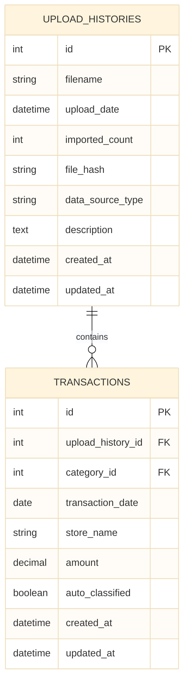

# アップロード履歴マスタ DB スキーマ仕様書

**バージョン**: 1.0  
**作成日**: 2025 年 10 月 31 日  
**更新日**: 2025 年 11 月 5 日

---

## 📋 目次

1. [テーブル定義](#1-テーブル定義)
2. [リレーション](#2-リレーション)
3. [インデックス設計](#3-インデックス設計)
4. [削除時のカスケード処理](#4-削除時のカスケード処理)
5. [マイグレーション例](#5-マイグレーション例)

---

## 1. テーブル定義

### 1.1 テーブル構造

```sql
CREATE TABLE upload_histories (
  id INTEGER PRIMARY KEY AUTOINCREMENT,
  filename VARCHAR(255) NOT NULL,
  upload_date DATETIME NOT NULL,
  imported_count INTEGER NOT NULL DEFAULT 0,
  file_hash VARCHAR(32),
  data_source_type VARCHAR(50) NOT NULL DEFAULT 'rakuten',
  description TEXT,
  created_at DATETIME NOT NULL DEFAULT CURRENT_TIMESTAMP,
  updated_at DATETIME NOT NULL DEFAULT CURRENT_TIMESTAMP
);
```

### 1.2 カラム詳細

| カラム名           | 型           | 制約                       | デフォルト値      | 説明                         |
| ------------------ | ------------ | -------------------------- | ----------------- | ---------------------------- |
| `id`               | INTEGER      | PRIMARY KEY, AUTOINCREMENT | -                 | 主キー                       |
| `filename`         | VARCHAR(255) | NOT NULL                   | -                 | アップロードされたファイル名 |
| `upload_date`      | DATETIME     | NOT NULL                   | -                 | アップロード日時             |
| `imported_count`   | INTEGER      | NOT NULL                   | 0                 | インポート件数               |
| `file_hash`        | VARCHAR(32)  | -                          | NULL              | MD5 ハッシュ（重複チェック） |
| `data_source_type` | VARCHAR(50)  | NOT NULL                   | 'rakuten'         | データソースタイプ           |
| `description`      | TEXT         | -                          | NULL              | 備考・説明                   |
| `created_at`       | DATETIME     | NOT NULL                   | CURRENT_TIMESTAMP | 作成日時                     |
| `updated_at`       | DATETIME     | NOT NULL                   | CURRENT_TIMESTAMP | 更新日時                     |

### 1.3 データ型の説明

#### INTEGER (id, imported_count)

- **id**: 主キー、AUTOINCREMENT により自動採番
- **imported_count**: インポート件数（0 以上の整数）

#### VARCHAR(255) (filename)

- **用途**: CSV ファイル名
- **例**: `rakuten_card_2025_10.csv`
- **制約**: NOT NULL

#### DATETIME (upload_date, created_at, updated_at)

- **用途**: 日時情報
- **形式**: ISO 8601 形式（`YYYY-MM-DD HH:MM:SS`）
- **タイムゾーン**: サーバーのタイムゾーン（JST）

#### VARCHAR(32) (file_hash)

- **用途**: MD5 ハッシュ値（16 進数 32 文字）
- **例**: `abc123def45678901234567890123456`
- **特徴**: NULL 可（重複チェック用）

#### VARCHAR(50) (data_source_type)

- **用途**: データソースタイプ識別
- **値**: `rakuten`, `epos`
- **デフォルト**: `rakuten`

#### TEXT (description)

- **用途**: 備考・説明文
- **特徴**: 長文に対応

---

## 2. リレーション

### 2.1 UploadHistories ↔ Transactions (1:N)

#### リレーション定義

```ruby
# app/models/upload_history.rb
has_many :transactions, dependent: :destroy

# app/models/transaction.rb
belongs_to :upload_history, optional: true
```

#### 外部キー

```sql
-- transactions テーブルに外部キー
ALTER TABLE transactions
ADD COLUMN upload_history_id INTEGER;

-- 外部キー制約
CREATE INDEX idx_transactions_upload_history_id 
ON transactions(upload_history_id);

-- 外部キー参照（SQLite では外部キー制約は別途設定）
-- FOREIGN KEY (upload_history_id) REFERENCES upload_histories(id)
```

#### リレーションの意味

- **1:N 関係**: 1 つのアップロード履歴は複数の取引データを含む
- **用途**: どの CSV ファイルからインポートされたかを追跡
- **削除時**: アップロード履歴削除時、関連する取引も削除（カスケード削除）

### 2.2 リレーション図



---

## 3. インデックス設計

### 3.1 インデックス一覧

```sql
-- アップロード日時での検索を高速化
CREATE INDEX idx_upload_histories_upload_date ON upload_histories(upload_date);

-- ファイルハッシュでの重複チェックを高速化
CREATE INDEX idx_upload_histories_file_hash ON upload_histories(file_hash);
```

### 3.2 インデックス詳細

#### idx_upload_histories_upload_date

- **対象カラム**: `upload_date`
- **タイプ**: 通常インデックス
- **目的**: 日時順でのソート・検索を高速化
- **使用クエリ例**:
  ```ruby
  UploadHistory.recent  # scope: order(upload_date: :desc)
  UploadHistory.where("upload_date >= ?", 1.month.ago)
  ```

#### idx_upload_histories_file_hash

- **対象カラム**: `file_hash`
- **タイプ**: 通常インデックス
- **目的**: 重複チェック時の検索を高速化
- **使用クエリ例**:
  ```ruby
  UploadHistory.find_by(file_hash: calculated_hash)
  ```

### 3.3 インデックス未使用のカラム

以下のカラムにはインデックスを設定していません：

- `id`: PRIMARY KEY により自動的にインデックス化
- `filename`: 検索条件として使用されない
- `imported_count`: 統計クエリの必要性が低い
- `data_source_type`: フィルタ条件として使用されない（将来的に検討）

---

## 4. 削除時のカスケード処理

### 4.1 カスケード削除の定義

```ruby
# app/models/upload_history.rb
has_many :transactions, dependent: :destroy
```

**意味**: アップロード履歴が削除されると、関連する取引データも自動的に削除される

### 4.2 削除フロー

```
1. ユーザーがアップロード履歴を削除
   ↓
2. UploadHistory#destroy 実行
   ↓
3. dependent: :destroy により
   → 関連する Transaction レコードを検索
   → 各 Transaction#destroy を実行
   ↓
4. UploadHistory レコード削除
   ↓
5. 削除完了
```

### 4.3 実装例

#### 4.3.1 Rails での実装

```ruby
# アップロード履歴を削除
upload_history = UploadHistory.find(params[:id])
deleted_count = upload_history.transactions.count

# カスケード削除が実行される
upload_history.destroy
# => 関連する transactions も削除される

# 削除件数を返す
render json: {
  message: "アップロード履歴を削除しました",
  deleted_transactions_count: deleted_count
}
```

#### 4.3.2 SQL での直接削除（参考）

```sql
-- 注意: カスケード削除は Rails の dependent: :destroy で処理
-- 直接 SQL で削除する場合は、先に関連データを削除する必要がある

-- 1. 関連する取引を削除
DELETE FROM transactions 
WHERE upload_history_id = :upload_history_id;

-- 2. アップロード履歴を削除
DELETE FROM upload_histories 
WHERE id = :upload_history_id;
```

### 4.4 カスケード削除の注意点

#### 4.4.1 データ損失の警告

- **重要**: アップロード履歴を削除すると、関連する全取引データが削除される
- **対策**: 削除前に確認ダイアログを表示
- **UI**: 削除対象の取引件数を事前に表示

#### 4.4.2 バッチ削除時の注意

```ruby
# 複数のアップロード履歴を削除する場合
upload_histories = UploadHistory.where(id: selected_ids)

# 削除対象の取引件数を事前に計算
total_transactions = Transaction.where(upload_history_id: selected_ids).count

# 確認メッセージ
confirm_message = "選択した#{upload_histories.count}個のファイルのデータ（合計#{total_transactions}件）を完全に削除しますか？"

# 削除実行
upload_histories.each(&:destroy)
```

---

## 5. マイグレーション例

### 5.1 テーブル作成マイグレーション

```ruby
# db/migrate/YYYYMMDDHHMMSS_create_upload_histories.rb

class CreateUploadHistories < ActiveRecord::Migration[8.0]
  def change
    create_table :upload_histories do |t|
      t.string :filename, null: false
      t.datetime :upload_date, null: false
      t.integer :imported_count, default: 0, null: false
      t.string :file_hash
      t.string :data_source_type, default: 'rakuten', null: false
      t.text :description

      t.timestamps
    end

    add_index :upload_histories, :upload_date
    add_index :upload_histories, :file_hash
  end
end
```

### 5.2 カラム追加マイグレーション（将来の拡張例）

```ruby
# db/migrate/YYYYMMDDHHMMSS_add_data_source_type_to_upload_histories.rb

class AddDataSourceTypeToUploadHistories < ActiveRecord::Migration[8.0]
  def change
    add_column :upload_histories, :data_source_type, :string, 
               default: 'rakuten', null: false
  end
end
```

### 5.3 マイグレーション実行

```bash
# マイグレーション実行
rails db:migrate

# ロールバック（必要に応じて）
rails db:rollback

# 特定のマイグレーションまでロールバック
rails db:migrate:down VERSION=YYYYMMDDHHMMSS
```

---

## 6. バリデーション

### 6.1 Rails Model でのバリデーション

```ruby
# app/models/upload_history.rb

class UploadHistory < ApplicationRecord
  has_many :transactions, dependent: :destroy

  # 必須チェック
  validates :filename, presence: true
  validates :upload_date, presence: true
  validates :imported_count, presence: true, 
            numericality: { greater_than_or_equal_to: 0 }
  
  # スコープ
  scope :recent, -> { order(upload_date: :desc) }
  
  # 表示メソッド
  def display_name
    "#{filename} (#{imported_count}件)"
  end
  
  def formatted_upload_date
    upload_date.in_time_zone("Asia/Tokyo").strftime("%Y/%m/%d %H:%M JST")
  end
end
```

### 6.2 バリデーション詳細

#### filename のバリデーション

- **必須**: `presence: true`
- **エラーメッセージ**: "ファイル名は必須です"

#### upload_date のバリデーション

- **必須**: `presence: true`
- **エラーメッセージ**: "アップロード日時は必須です"

#### imported_count のバリデーション

- **必須**: `presence: true`
- **数値**: `numericality: { greater_than_or_equal_to: 0 }`
- **エラーメッセージ**: "インポート件数は 0 以上の整数である必要があります"

---

## 7. パフォーマンス考慮

### 7.1 クエリ最適化

#### 日時順でのソート

```ruby
# インデックスを使用した効率的なクエリ
UploadHistory.recent  # scope: order(upload_date: :desc)
```

**実行される SQL**:
```sql
SELECT * FROM upload_histories 
ORDER BY upload_date DESC;
```

**インデックス**: `idx_upload_histories_upload_date` が使用される

#### 重複チェック

```ruby
UploadHistory.find_by(file_hash: calculated_hash)
```

**実行される SQL**:
```sql
SELECT * FROM upload_histories 
WHERE file_hash = :calculated_hash 
LIMIT 1;
```

**インデックス**: `idx_upload_histories_file_hash` が使用される

### 7.2 大量データ時の考慮

#### ページネーション（将来的に検討）

```ruby
# 大量のアップロード履歴がある場合
UploadHistory.recent.page(params[:page]).per(20)
```

#### アーカイブ機能（将来的に検討）

古いアップロード履歴をアーカイブする機能を検討

---

## 8. まとめ

### 8.1 スキーマ設計の要点

- **シンプルな構造**: 必要最小限のカラムで構成
- **インデックス最適化**: 検索・ソートに必要なインデックスのみ設定
- **カスケード削除**: データ整合性を保つための適切な削除処理
- **拡張性**: 将来的なカラム追加に対応可能

### 8.2 次のステップ

- [01_upload_history_spec.md](./01_upload_history_spec.md) - アップロード履歴仕様
- [03_file_management.md](./03_file_management.md) - ファイル管理（ハッシュ・エンコーディング）

---

**📝 備考**: このドキュメントは、アップロード履歴マスタのデータベース設計を定義しています。実際の実装時は、Rails のマイグレーションと Model のバリデーションを確認してください。

