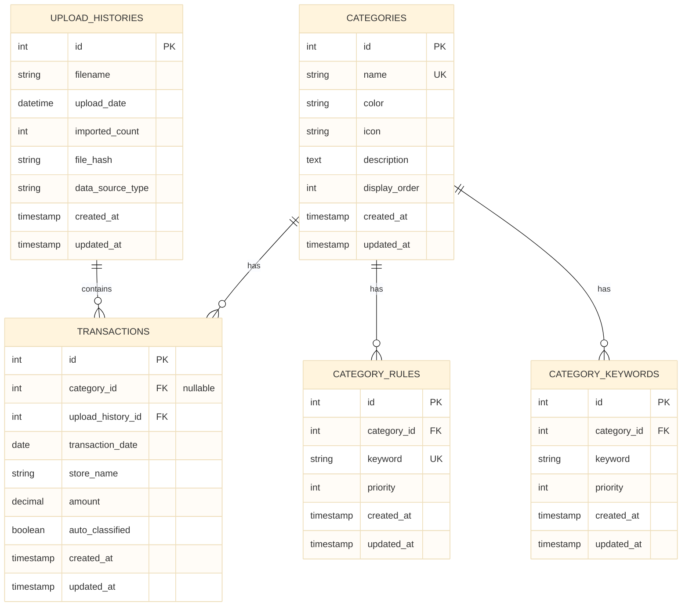

# データ関係図 - システム統合用

**バージョン**: 1.0  
**作成日**: 2025 年 10 月 31 日  
**更新日**: 2025 年 11 月 5 日

---

## 📋 目次

1. [概要](#1-概要)
2. [Categories ↔ CategoryRules 関係](#2-categories--categoryrules-関係)
3. [Transactions ↔ Categories 関係](#3-transactions--categories-関係)
4. [Transactions ↔ UploadHistories 関係](#4-transactions--uploadhistories-関係)
5. [全体 ER 図](#5-全体-er-図)

---

## 1. 概要

### 1.1 マスタデータの関係性

Budget Book アプリケーションでは、以下のマスタデータが相互に関連しています：

- **Categories**: カテゴリマスタ（基本マスタ）
- **CategoryRules**: 分類ルールマスタ（Categories に依存）
- **Transactions**: 取引データ（Categories, UploadHistories に依存）
- **UploadHistories**: アップロード履歴マスタ（Transactions と関連）

### 1.2 関係性の重要性

マスタデータ間の関係性を理解することで：

- **データ整合性**: 外部キー制約により整合性を確保
- **削除処理**: カスケード削除の動作を理解
- **クエリ最適化**: リレーションを活用した効率的なクエリ
- **拡張性**: 将来的な機能追加時の影響範囲を把握

---

## 2. Categories ↔ CategoryRules 関係

### 2.1 リレーション定義

```ruby
# app/models/category.rb
has_many :category_rules, dependent: :destroy

# app/models/category_rule.rb
belongs_to :category
```

### 2.2 関係性の詳細

#### 2.2.1 関係タイプ

- **タイプ**: 1:N（1 つのカテゴリは複数の分類ルールを持つ）
- **外部キー**: `category_rules.category_id` → `categories.id`
- **削除時**: `dependent: :destroy`（カテゴリ削除時、ルールも削除）

#### 2.2.2 使用シーン

**カテゴリからルールを取得**:
```ruby
category = Category.find(2)  # 食費
rules = category.category_rules
# => 食費カテゴリに関連する全分類ルール

rules.by_priority
# => 優先度順でソートされたルール
```

**ルールからカテゴリを取得**:
```ruby
rule = CategoryRule.find(1)
category = rule.category
# => このルールが指すカテゴリ
```

### 2.3 データフロー

```
1. カテゴリマスタ作成（初期化）
   → Categories: 7 カテゴリ作成
   ↓
2. 分類ルール作成
   → CategoryRules: 各カテゴリにルールを追加
   ↓
3. CSV 自動分類
   → CategoryRule.find_category_for_store(store_name)
   → マッチしたルールの category を返す
   ↓
4. 取引データにカテゴリを設定
   → Transaction.category_id = category.id
```

---

## 3. Transactions ↔ Categories 関係

### 3.1 リレーション定義

```ruby
# app/models/transaction.rb
belongs_to :category, optional: true

# app/models/category.rb
has_many :transactions, dependent: :nullify
```

### 3.2 関係性の詳細

#### 3.2.1 関係タイプ

- **タイプ**: N:1（複数の取引は 1 つのカテゴリに属する）
- **外部キー**: `transactions.category_id` → `categories.id`
- **削除時**: `dependent: :nullify`（カテゴリ削除時、取引の category_id は NULL になる）

#### 3.2.2 使用シーン

**カテゴリ別集計**:
```ruby
category = Category.find(2)  # 食費
transactions = category.transactions
total_amount = transactions.sum(:amount)
# => 食費カテゴリの合計金額
```

**取引からカテゴリ情報を取得**:
```ruby
transaction = Transaction.find(1)
category = transaction.category
# => この取引のカテゴリ（nil の場合もある）
```

### 3.3 データフロー

```
1. CSV インポート
   → Transaction レコード作成
   ↓
2. 自動分類
   → CategoryRule.find_category_for_store(store_name)
   → マッチしたカテゴリを取得
   ↓
3. カテゴリ設定
   → Transaction.category_id = category.id
   ↓
4. 統計・表示
   → カテゴリ別集計
   → グラフ表示
```

---

## 4. Transactions ↔ UploadHistories 関係

### 4.1 リレーション定義

```ruby
# app/models/transaction.rb
belongs_to :upload_history, optional: true

# app/models/upload_history.rb
has_many :transactions, dependent: :destroy
```

### 4.2 関係性の詳細

#### 4.2.1 関係タイプ

- **タイプ**: N:1（複数の取引は 1 つのアップロード履歴に属する）
- **外部キー**: `transactions.upload_history_id` → `upload_histories.id`
- **削除時**: `dependent: :destroy`（アップロード履歴削除時、取引も削除）

#### 4.2.2 使用シーン

**アップロード履歴から取引を取得**:
```ruby
upload_history = UploadHistory.find(1)
transactions = upload_history.transactions
# => この CSV からインポートされた全取引

count = upload_history.transactions.count
# => インポート件数
```

**取引からアップロード履歴を取得**:
```ruby
transaction = Transaction.find(1)
upload_history = transaction.upload_history
# => この取引がインポートされた CSV の履歴
```

### 4.3 データフロー

```
1. CSV アップロード
   → UploadHistory レコード作成
   ↓
2. CSV インポート処理
   → Transaction レコード作成
   → Transaction.upload_history_id = upload_history.id
   ↓
3. アップロード履歴削除
   → UploadHistory.destroy
   → 関連する全 Transaction も削除（カスケード削除）
```

---

## 5. 全体 ER 図

### 5.1 エンティティ関係図



### 5.2 リレーション一覧

| 関係 | タイプ | 外部キー | 削除時動作 |
|------|--------|---------|-----------|
| Categories ↔ Transactions | 1:N | `transactions.category_id` | `nullify` |
| Categories ↔ CategoryRules | 1:N | `category_rules.category_id` | `destroy` |
| Categories ↔ CategoryKeywords | 1:N | `category_keywords.category_id` | `destroy` |
| UploadHistories ↔ Transactions | 1:N | `transactions.upload_history_id` | `destroy` |

### 5.3 データ整合性

#### 5.3.1 外部キー制約

```sql
-- Categories → CategoryRules
FOREIGN KEY (category_id) REFERENCES categories(id)
ON DELETE CASCADE

-- Categories → Transactions
FOREIGN KEY (category_id) REFERENCES categories(id)
ON DELETE SET NULL

-- UploadHistories → Transactions
FOREIGN KEY (upload_history_id) REFERENCES upload_histories(id)
ON DELETE CASCADE
```

#### 5.3.2 整合性チェック

**カテゴリ削除時**:
- 関連する CategoryRules は削除される
- 関連する Transactions の category_id は NULL になる（データは保持）

**アップロード履歴削除時**:
- 関連する Transactions は削除される（データは失われる）

---

## 6. クエリ最適化

### 6.1 リレーションを活用したクエリ

#### 6.1.1 カテゴリ別集計（includes 使用）

```ruby
# N+1 問題を回避
categories = Category.includes(:transactions).all
categories.each do |category|
  total = category.transactions.sum(:amount)
  # 効率的に集計
end
```

#### 6.1.2 ルール一覧取得（joins 使用）

```ruby
# カテゴリ情報を含めて取得
rules = CategoryRule.includes(:category).by_priority
rules.each do |rule|
  puts "#{rule.keyword} → #{rule.category.name}"
end
```

### 6.2 パフォーマンス考慮

- **includes**: 関連データを事前読み込み（N+1 問題回避）
- **joins**: 関連データでフィルタリング・ソート
- **counter_cache**: 件数カウントの高速化（将来的に検討）

---

## 7. まとめ

### 7.1 データ関係の重要性

マスタデータ間の関係性を理解することで：

- **データ整合性**: 外部キー制約により整合性を確保
- **削除処理**: カスケード削除の動作を理解
- **クエリ最適化**: リレーションを活用した効率的なクエリ
- **拡張性**: 将来的な機能追加時の影響範囲を把握

### 7.2 次のステップ

- [02_master_lifecycle.md](./02_master_lifecycle.md) - マスタライフサイクル
- [03_extension_roadmap.md](./03_extension_roadmap.md) - 拡張計画

---

**📝 備考**: このドキュメントは、マスタデータ間の関係性を定義しています。実際の実装では、Rails のリレーション定義とバリデーションを確認してください。


