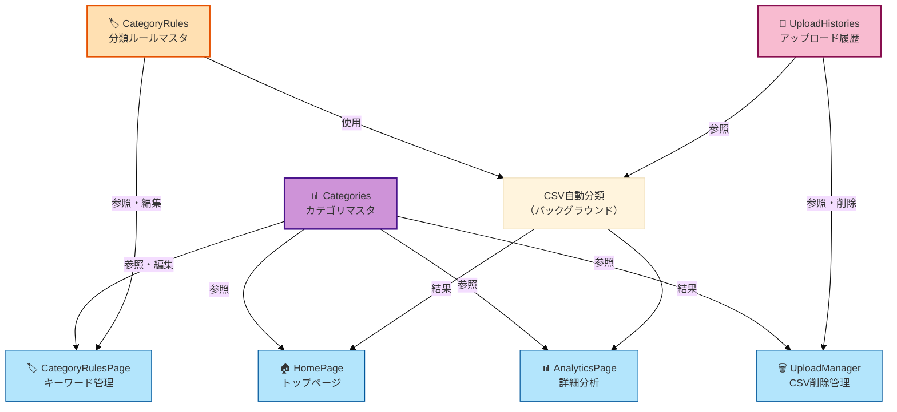

# マスタライフサイクル - システム統合用

**バージョン**: 1.0  
**作成日**: 2025 年 10 月 31 日  
**更新日**: 2025 年 11 月 5 日

---

## 📋 目次

1. [概要](#1-概要)
2. [初期化 → 使用開始 → 編集 → 改善のフロー](#2-初期化--使用開始--編集--改善のフロー)
3. [4 ページ間でのマスタ参照関係](#3-4-ページ間でのマスタ参照関係)
4. [アップデート時の注意点](#4-アップデート時の注意点)

---

## 1. 概要

### 1.1 マスタライフサイクルとは

**マスタライフサイクル**は、マスタデータが作成されてから更新・改善されるまでの一連の流れです。

**ライフサイクル段階**:
1. **初期化**: データベースに初期データを投入
2. **使用開始**: アプリケーションでマスタを使用開始
3. **編集**: ユーザーがマスタを追加・編集
4. **改善**: 分類精度を向上させるための継続的な改善

### 1.2 マスタ別のライフサイクル

| マスタ | 初期化 | 使用開始 | 編集 | 改善 |
|--------|--------|---------|------|------|
| **Categories** | Seed データ投入 | 全ページで参照 | ❌ 不可 | ⚠️ 検討中 |
| **CategoryRules** | 初期ルール投入 | CSV 自動分類 | ✅ 可 | ✅ 継続的 |
| **UploadHistories** | 自動作成 | 履歴管理 | ❌ 不可 | - |

---

## 2. 初期化 → 使用開始 → 編集 → 改善のフロー

### 2.1 フロー図

```
┌─────────────────┐
│ 初期化          │
│ (DB Seed)       │
└────────┬────────┘
         │
         ▼
┌─────────────────┐
│ 使用開始        │
│ (参照のみ)      │
└────────┬────────┘
         │
         ▼
┌─────────────────┐
│ ユーザー編集    │
│ (CategoryRules) │
└────────┬────────┘
         │
         ▼
┌─────────────────┐
│ 分類精度向上    │
│ (ルール調整)    │
└─────────────────┘
```

### 2.2 各段階の詳細

#### 2.2.1 初期化（DB Seed）

**目的**: データベースに初期データを投入

**実行方法**:
```bash
rails db:seed
```

**投入データ**:
- **Categories**: 7 カテゴリ（投資、食費、日用品費、娯楽費、住宅費、交通費、その他）
- **CategoryRules**: 各カテゴリの初期ルールセット（オプション）

**実装**:
```ruby
# db/seeds.rb
categories_data = [
  { name: '投資', color: '#FF6384', display_order: 1 },
  { name: '食費', color: '#4BC0C0', display_order: 2 },
  # ...
]

categories_data.each do |cat|
  Category.find_or_create_by!(name: cat[:name]) do |c|
    c.color = cat[:color]
    c.display_order = cat[:display_order]
  end
end
```

#### 2.2.2 使用開始（参照のみ）

**目的**: アプリケーションでマスタを使用開始

**使用箇所**:
- 🏠 **HomePage**: カテゴリマスタから色・アイコンを取得
- 📊 **AnalyticsPage**: カテゴリフィルタ・統計表示
- 🏷️ **CategoryRulesPage**: ルール作成時のカテゴリ選択
- **CSV 自動分類**: CategoryRules で店名マッチング

**データフロー**:
```
1. ページロード
   ↓
2. API: GET /api/v1/categories
   → カテゴリ一覧取得
   ↓
3. UI 表示
   → グラフ（色・アイコン）
   → フィルタ（カテゴリ選択）
```

#### 2.2.3 ユーザー編集（CategoryRules）

**目的**: ユーザーが分類ルールを追加・編集

**編集可能なマスタ**:
- **CategoryRules**: ルール追加・編集・削除

**編集不可なマスタ**:
- **Categories**: 追加・削除不可（将来的に検討）
- **UploadHistories**: システム自動管理

**実装例**:
```ruby
# ルール追加
CategoryRule.create!(
  category_id: 2,  # 食費
  keyword: 'セブン',
  priority: 105
)
```

#### 2.2.4 分類精度向上（ルール調整）

**目的**: 分類精度を継続的に向上させる

**改善手法**:
1. **未分類取引の確認**: 「その他」カテゴリの取引を確認
2. **ルール追加**: 新しい店舗名に対応するルールを追加
3. **優先度調整**: 複数マッチ時の優先度を調整
4. **ルール削除**: 不要なルールを削除

**実装例**:
```ruby
# 未分類取引が多い店舗を確認
Transaction.where(category_id: nil)
  .group(:store_name)
  .count
  .sort_by { |k, v| -v }
  .first(10)

# 新しいルールを追加
CategoryRule.create!(
  category_id: 2,
  keyword: '新しい店舗名',
  priority: 105
)
```

---

## 3. 4 ページ間でのマスタ参照関係

### 3.1 ページ別マスタ参照図



### 3.2 ページ別参照詳細

#### 3.2.1 HomePage（トップページ）

**参照マスタ**: `Categories`

**参照タイプ**: 読み取り専用

**用途**:
- グラフ表示時の色分け（`color`）
- カテゴリ別集計の基準（`id`）
- UI 表示順序の制御（`display_order`）

#### 3.2.2 AnalyticsPage（詳細分析）

**参照マスタ**: `Categories`

**参照タイプ**: 読み取り専用、カテゴリ手動修正時は更新

**用途**:
- カテゴリ別フィルタ（`name`, `id`）
- カテゴリ手動修正時の選択肢（`id`）
- 統計表示時のカテゴリ名・色（`name`, `color`）

#### 3.2.3 CategoryRulesPage（キーワード管理）

**参照マスタ**: `Categories`, `CategoryRules`

**参照タイプ**: 読み書き可能

**用途**:
- **Categories**: ルール作成時のカテゴリ選択肢（参照のみ）
- **CategoryRules**: ルール一覧表示、追加・編集・削除（読み書き）

#### 3.2.4 UploadManager（CSV 削除管理）

**参照マスタ**: `UploadHistories`

**参照タイプ**: 読み取り・削除

**用途**:
- アップロード履歴一覧表示（読み取り）
- CSV 削除機能（削除）

---

## 4. アップデート時の注意点

### 4.1 カテゴリマスタの更新

#### 4.1.1 現在の制約

- **追加**: ❌ 不可（初期値固定）
- **編集**: ⚠️ 検討中（将来的に実装予定）
- **削除**: ❌ 不可（データ整合性のため）

#### 4.1.2 更新時の注意点

**カテゴリ名変更時**:
- 関連する CategoryRules の category_id は変更不要（外部キーで維持）
- フロントエンドの表示名は自動更新される

**カテゴリ削除時**（将来的に実装）:
- 関連する CategoryRules は削除される（`dependent: :destroy`）
- 関連する Transactions の category_id は NULL になる（`dependent: :nullify`）

### 4.2 分類ルールマスタの更新

#### 4.2.1 更新タイミング

**ルール追加時**:
- CSV 自動分類に即座に反映
- 既存の未分類取引には影響しない（再インポートが必要）

**ルール編集時**:
- キーワード変更: 新しいキーワードでマッチング
- 優先度変更: マッチング順序が変更される
- カテゴリ変更: マッチした取引のカテゴリが変更される

**ルール削除時**:
- 該当キーワードでのマッチングが無効になる
- 既存の取引データは変更されない

#### 4.2.2 更新時の注意点

**優先度の調整**:
- 複数ルールがマッチする場合、優先度が高いものが優先される
- より具体的なキーワードに高い優先度を設定する

**キーワードの重複**:
- 現在: `keyword` に UNIQUE 制約があるため、重複不可
- 将来的に検討: 同じキーワードを異なるカテゴリに登録可能にする

### 4.3 アップロード履歴マスタの更新

#### 4.3.1 更新タイミング

**履歴作成時**:
- CSV アップロード時に自動作成
- ファイルハッシュで重複チェック

**履歴削除時**:
- 関連する Transactions も削除される（カスケード削除）
- **重要**: データが失われるため、削除前に確認が必要

#### 4.3.2 更新時の注意点

**削除時の影響範囲**:
- 削除対象の取引件数を事前に表示
- 確認ダイアログで警告を表示

**重複チェック**:
- 同じファイルの再アップロードは防止される
- ファイルハッシュで判定

---

## 5. マスタ更新フロー

### 5.1 ルール追加フロー

```
1. ユーザーが CategoryRulesPage でルール追加
   ↓
2. API: POST /api/v1/category_rules
   → バックエンドでルール作成
   ↓
3. after_create コールバック
   → CSV ファイルを更新（export_to_csv）
   ↓
4. 次回の CSV インポート時に反映
   → 新しいルールで自動分類
```

### 5.2 ルール編集フロー

```
1. ユーザーが CategoryRulesPage でルール編集
   ↓
2. API: PATCH /api/v1/category_rules/:id
   → バックエンドでルール更新
   ↓
3. after_update コールバック
   → CSV ファイルを更新（export_to_csv）
   ↓
4. 次回の CSV インポート時に反映
   → 更新されたルールで自動分類
```

### 5.3 ルール削除フロー

```
1. ユーザーが CategoryRulesPage でルール削除
   ↓
2. API: DELETE /api/v1/category_rules/:id
   → バックエンドでルール削除
   ↓
3. after_destroy コールバック
   → CSV ファイルを更新（export_to_csv）
   ↓
4. 次回の CSV インポート時に反映
   → 削除されたルールは使用されない
```

---

## 6. まとめ

### 6.1 マスタライフサイクルの重要性

マスタライフサイクルを理解することで：

- **データ管理**: マスタデータの適切な管理方法を理解
- **更新フロー**: マスタ更新時の影響範囲を把握
- **改善プロセス**: 継続的な分類精度向上のプロセスを理解

### 6.2 次のステップ

- [01_data_relationships.md](./01_data_relationships.md) - データ関係図
- [03_extension_roadmap.md](./03_extension_roadmap.md) - 拡張計画

---

**📝 備考**: このドキュメントは、マスタデータのライフサイクルを定義しています。実際の運用では、マスタ更新時の影響範囲を十分に確認してください。


